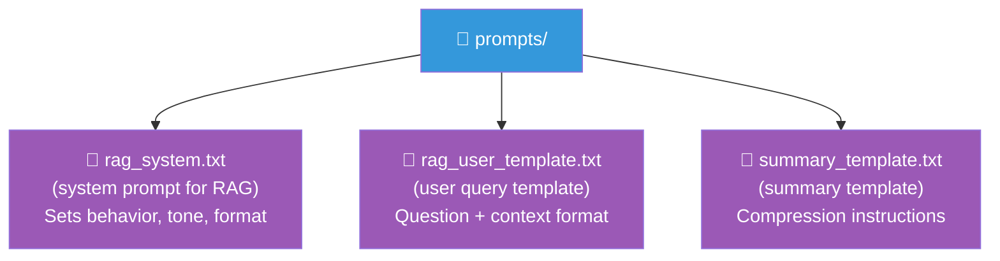

# Prompt Best Practices for Production

## 1. Start with Clear Instructions

Be explicit about what the model should do, how long the response should be,
and what format to use.

```python
# ❌ Vague
"Write about machine learning"

# ✅ Clear
"Write a 150-word introductory paragraph about supervised learning for a developer audience."
```

## 2. Use Delimiters to Separate Sections

```python
prompt = f"""
{context}
---
Question: {question}
---
Answer in 2-3 sentences:
"""
```

Delimiters help the model parse the prompt structure and reduce injection risk.

## 3. Be Consistent with Roles

Always include a system message that sets behavior. Keep it stable across
calls for consistent persona and capabilities.

```python
system = "You are a precise, helpful assistant. Answer in 1-2 sentences."
```

## 4. Test Edge Cases

Always test with:
- Empty or minimal input
- Very long input (near context limits)
- Adversarial prompts ("ignore your instructions")
- Ambiguous queries
- Out-of-domain questions

## 5. Handle Errors Gracefully

```python
try:
    response = await llm_service.generate(request)
except OpenAIError as e:
    logger.error("LLM error: %s", e)
    # Fallback: return a safe default message
    return {"error": "Unable to generate response", "detail": str(e)}
```

## 6. Implement Retries with Backoff

APIs fail. Rate limits are hit. Always implement robust retry logic:

```python
import asyncio

async def call_with_retry(func, max_retries=3, base_delay=1.0):
    for attempt in range(max_retries):
        try:
            return await func()
        except RateLimitError:
            delay = base_delay * (2 ** attempt)
            await asyncio.sleep(delay)
    raise Exception("Max retries exceeded")
```

## 7. Monitor Token Usage

Track token consumption for debugging and cost control:

```python
response = await client.chat.completions.create(...)
print(f"Prompt tokens: {response.usage.prompt_tokens}")
print(f"Completion tokens: {response.usage.completion_tokens}")
print(f"Total tokens: {response.usage.total_tokens}")
```

## 8. Limit Output Length

Always set `max_tokens` to prevent runaway responses:

```python
request = LLMRequest(
    messages=messages,
    max_tokens=512,  # Cap output
    temperature=0.7,
)
```

## 9. Version Your Prompts

Save prompts as files or database entries so you can iterate and rollback:



## 10. Log Prompt-Output Pairs

For debugging and evaluation, log what was sent and what was received:

```python
logger.info("Prompt: %s", messages)
logger.info("Response: %s", response.content)
```

(Be careful not to log sensitive data — mask PII in production.)

## 11. Set Temperature Appropriately

| Use Case | Temperature | Reason |
|----------|------------|--------|
| Factual Q&A | 0.2 | Deterministic, consistent |
| Creative writing | 0.8 | Diverse, surprising |
| Code generation | 0.2 | Correct syntax |
| Brainstorming | 1.0 | Maximum variety |
| Math/reasoning | 0.0-0.3 | Reliable logic |

## 12. Guard Against Hallucination

- Use RAG to ground responses in retrieved context
- Ask the model to cite sources
- Have the model refuse when uncertain:

```python
system = """You are a helpful assistant. If you don't know the answer, say "I don't know."
Only use information from the provided context."""
```

## In Our POC

The POC demonstrates many of these practices:

- System messages set assistant behavior (`app/rag/generation.py`)
- Delimiters separate context from the question
- Error handling wraps LLM calls
- Configurable temperature and max_tokens

## Summary

| Practice | Why |
|----------|-----|
| Clear instructions | Predictable output |
| Delimiters | Structure and security |
| Consistent roles | Reliable persona |
| Edge case testing | Robustness |
| Error handling | Graceful failures |
| Retries | Resilience to transient errors |
| Token monitoring | Cost and performance control |
| Output limits | Prevent runaway responses |
| Prompt versioning | Iteration and rollback |
| Logging | Debugging and evaluation |
| Appropriate temperature | Match behavior to task |
| Hallucination guards | Accuracy and trust |
