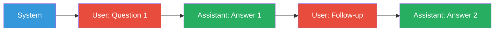

# Message Roles: System, User, Assistant

## The Three Roles

In chat-based LLM APIs, every message has a **role** that tells the model
how to interpret and respond to it:

| Role | Purpose | Who writes it? |
|------|---------|---------------|
| **system** | Sets behavior, tone, and context | Developer |
| **user** | The question, instruction, or input | User |
| **assistant** | Previous model responses | The model |

## System Messages

The system message (also called the "system prompt") defines the model's
persona, capabilities, and constraints:

```python
system_message = {
    "role": "system",
    "content": (
        "You are a helpful, knowledgeable assistant. "
        "You answer questions honestly and concisely. "
        "If you don't know something, say so."
    )
}
```

### Best Practices for System Messages

1. **Be specific** — define the exact role and behavior
2. **Constrain scope** — tell the model what NOT to do
3. **Set format expectations** — "Respond in JSON format"
4. **Chain of thought** — "Think step by step before answering"

### Example: Multi-role System Message

```python
system = "You are a senior Python engineer reviewing code for best practices. "
         "Focus on: security, performance, readability. "
         "Always explain your reasoning. "
         "Format feedback as a numbered list."
```

## User Messages

The user message contains the actual question, instruction, or task:

```python
user_message = {
    "role": "user",
    "content": "Explain the difference between list and tuple in Python."
}
```

### Types of User Messages

| Type | Example |
|------|---------|
| **Question** | "What is the capital of France?" |
| **Instruction** | "Write a Python function that reverses a string." |
| **Task** | "Summarize this article: [article text]" |
| **Code** | "Refactor this function to use less memory: [code]" |

## Assistant Messages

Assistant messages are the model's previous responses. They maintain
conversation context:

```python
assistant_message = {
    "role": "assistant",
    "content": "Lists are mutable and use square brackets. Tuples are immutable and use parentheses."
}
```

### Why Assistant Messages Matter

Including previous assistant responses allows **multi-turn conversations**:

```python
conversation = [
    {"role": "system", "content": "You are a coding tutor."},
    {"role": "user", "content": "Explain list comprehensions."},
    {"role": "assistant", "content": "A list comprehension creates a new list..."},
    {"role": "user", "content": "Now show me a dict comprehension example."},
]
# The model sees the full conversation and can reference its previous answer
```

## Order Matters

The order of messages defines the conversation history. The model processes
them sequentially:



## In Our POC

Our RAG pipeline constructs messages with all three roles:

```python
# app/rag/generation.py
messages = [
    ChatMessage(role=MessageRole.SYSTEM, content=...),    # Sets behavior
    # ChatMessage(role=MessageRole.ASSISTANT, content=...), # Previous responses (if any)
    ChatMessage(role=MessageRole.USER, content=...),      # Question + context
]
```

The system message tells the model to answer from context. The user message
contains the retrieved context and the question.

## Next Steps

- [Prompting Techniques](techniques.md) — Zero-shot vs. few-shot
- [Chain of Thought](techniques.md) — Making models reason step-by-step
