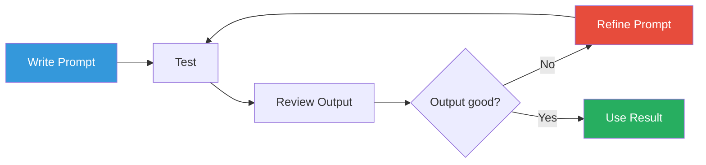

# What is a Prompt?

## Definition

A **prompt** is the input you give to a Generative AI model to elicit a response.

In the context of LLMs, a prompt is the text (or structured conversation)
that tells the model what to do and how to respond.

## The Anatomy of a Prompt

### System Message

Sets the model's behavior, personality, and context:

```text
You are a helpful assistant specialized in explaining quantum computing to beginners.
Always use analogies and avoid jargon.
```

### User Message

The actual question or instruction from the user:

```text
Explain quantum entanglement using a simple analogy.
```

### Assistant Message (optional)

Previous responses from the assistant, for context in multi-turn conversations:

```text
Quantum entanglement is like having two magic coins...
```

### Full Example

```python
messages = [
    {"role": "system", "content": "You are a helpful assistant specialized in quantum computing."},
    {"role": "user", "content": "Explain quantum entanglement using a simple analogy."}
]
```

## Why Prompts Matter

Unlike traditional software where you write explicit logic, with LLMs you
**describe** the desired behavior. The quality of the model's output is directly
proportional to the quality of the prompt.

| Prompt Quality | Result |
|----------------|--------|
| Vague: "Write about dogs" | Generic, unfocused text |
| Good: "Write a 3-sentence summary about golden retrievers for a pet adoption website" | Focused, useful content |
| Excellent: "Write a 3-sentence summary about golden retrievers for a pet adoption website. Use an enthusiastic tone and include their temperament." | On-brand, complete |

## Prompt Engineering

**Prompt engineering** is the practice of designing effective prompts. It involves
understanding how different prompt structures, wording, and parameters influence
the model's output.

### The Iterative Process



## Prompt in Our POC

In our codebase, prompts are constructed in the RAG pipeline:

```python
# From app/rag/generation.py
messages = [
    ChatMessage(role=MessageRole.SYSTEM, content="You are a helpful assistant..."),
    ChatMessage(role=MessageRole.USER, content=f"Context:\n{context}\n\nQuestion: {question}\n\nAnswer:"),
]
```

The system message grounds the assistant's behavior, the retrieved context
provides knowledge, and the user question is what the model answers.

## Next Steps

- [Message Roles](message-roles.md) — System, User, Assistant
- [Prompting Techniques](techniques.md) — Zero-shot, few-shot, chain-of-thought
- [Prompt Templates](templates.md) — Reusable prompt patterns
