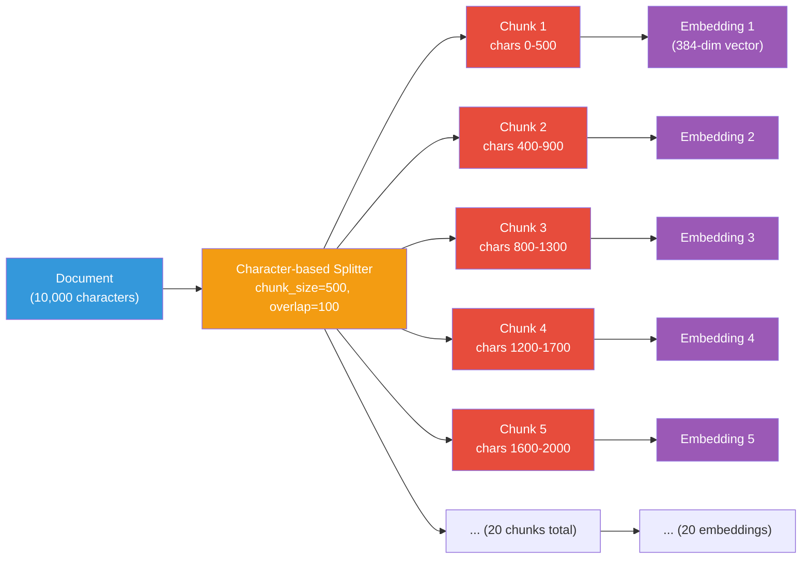
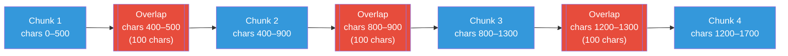
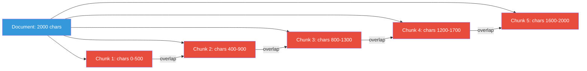

# Chunking Strategies

## What is Chunking?

**Chunking** is the process of splitting a document into smaller, manageable
pieces. Each chunk becomes a single vector in the vector database.



## Why Chunk?

### Context Window Limits

LLMs have finite context windows (e.g., 8K-128K tokens). You can't pass an
entire book to an LLM. Chunking breaks content into digestible pieces.

### Embedding Input Limits

Embedding models also have token limits (e.g., 512 or 8192 tokens). Long texts
must be split before embedding.

### Retrieval Precision

Smaller chunks mean more targeted retrieval — the LLM sees only the relevant
portion, not the entire document.

## Chunking Parameters

### Chunk Size

The maximum size of each chunk (in characters or tokens):

| Size | Characteristics |
|------|-----------------|
| **100-200** | Very focused, may miss context |
| **500** | Balanced (POC default) |
| **1000-2000** | More context, less precise |

### Chunk Overlap

The number of characters/tokens that overlap between adjacent chunks:



Overlap ensures that information spanning chunk boundaries is not lost.
When a concept falls at the boundary between two chunks, the overlap
guarantees that at least one chunk contains the complete context.

| Overlap | Characteristics |
|---------|-----------------|
| **0** | No context sharing (risky) |
| **50-100** | Light overlap (POC default: 100) |
| **200+** | Heavy overlap (redundant storage) |

## Chunking Strategies

### 1. Fixed-Size Splitting

Split text at fixed intervals, ignoring sentence boundaries:

```python
def fixed_size_chunk(text, chunk_size=500, overlap=100):
    chunks = []
    start = 0
    while start < len(text):
        chunks.append(text[start:start + chunk_size])
        start += chunk_size - overlap
    return chunks
```

**Pros:** Simple, predictable
**Cons:** May cut sentences mid-way

### 2. Sentence-Based Splitting

Split at sentence boundaries:

```python
import re

def sentence_chunk(text, max_chars=500):
    sentences = re.split(r'(?<=[.!?]) +', text)
    chunks = []
    current = []
    current_len = 0

    for sentence in sentences:
        if current_len + len(sentence) > max_chars and current:
            chunks.append(" ".join(current))
            current = [sentence]
            current_len = len(sentence)
        else:
            current.append(sentence)
            current_len += len(sentence)

    if current:
        chunks.append(" ".join(current))
    return chunks
```

**Pros:** Preserves sentence boundaries
**Cons:** Variable chunk sizes

### 3. Recursive/RecursiveCharacter Splitting

Try multiple separators in order (used by LangChain):

```python
# Try to split by:
# 1. Paragraph breaks (\n\n)
# 2. Line breaks (\n)
# 3. Sentences (.!?)
# 4. Words (" ")
# 5. Characters
```

This produces the most natural chunks.

### 4. Token-Based Splitting

Split by token count rather than characters:

```python
from transformers import AutoTokenizer

tokenizer = AutoTokenizer.from_pretrained("bert-base-uncased")

def token_chunk(text, max_tokens=128):
    tokens = tokenizer.tokenize(text)
    chunks = []
    for i in range(0, len(tokens), max_tokens):
        chunk_tokens = tokens[i:i + max_tokens]
        chunks.append(tokenizer.convert_tokens_to_string(chunk_tokens))
    return chunks
```

**Pros:** Respects model token limits
**Cons:** Tokenizer overhead

## In Our POC

We use a simple character-based splitter:

```python
# app/rag/ingestion.py
def chunk_text(
    text: str,
    chunk_size: int = 500,    # ~125 words, ~75 tokens
    chunk_overlap: int = 100,  # 20% overlap
) -> list[str]:
    if len(text) <= chunk_size:
        return [text]

    chunks = []
    start = 0
    while start < len(text):
        end = start + chunk_size
        chunks.append(text[start:end])
        start = end - chunk_overlap
    return chunks
```

### Configuration

```bash
# .env
RAG_CHUNK_SIZE=500
RAG_CHUNK_OVERLAP=100
```

### Why Character-Based for the POC?

1. **No extra dependencies** — uses pure Python
2. **Easy to understand** — the algorithm is visible and simple
3. **Works with any text** — no tokenizer coupling
4. **Sufficient for learning** — the concepts are the same

## Visualizing Chunks



## Chunk Size Trade-offs

| Chunk Size | Pro | Con |
|-----------|-----|-----|
| **Small (100-200)** | Precise retrieval, more chunks | May lose context, higher storage cost |
| **Medium (500-1000)** | Good balance | May miss broader context |
| **Large (2000+)** | Full context preserved | Less precise retrieval, may exceed context window |

## Next Steps

- [Retrieval](retrieval.md) — How chunks are searched
- [Context Construction](context-construction.md) — How chunks are assembled
