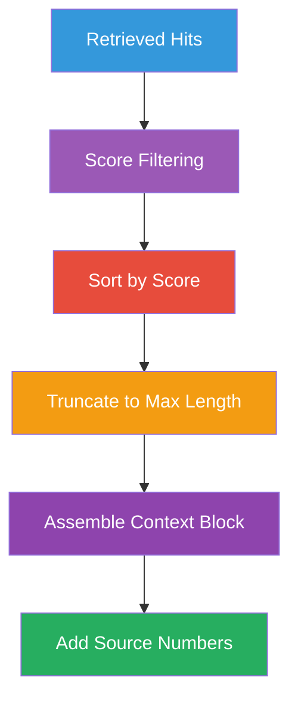

# Context Construction

After retrieval, the system must assemble the retrieved document chunks into
a **context** that the LLM can use effectively.

## Why Context Construction Matters

The LLM doesn't see raw database results — it sees a carefully formatted
prompt. How you assemble the context directly affects answer quality:

- Too much irrelevant context → distracts the LLM
- Too little context → LLM lacks the information to answer
- Poor ordering → LLM focuses on wrong information
- No source attribution → user can't verify claims

## The Context Construction Flow



## Step 1: Score Filtering

Not all retrieved hits are useful. You can filter by similarity score:

```python
def filter_by_score(hits: list[SearchHit], min_score: float = 0.3) -> list[SearchHit]:
    return [h for h in hits if h.score >= min_score]
```

If no hits pass the threshold, the system should indicate it cannot answer
from the retrieved context.

## Step 2: Ordering

Sort hits by similarity score (highest first) so the most relevant
information appears first in the context.

## Step 3: Truncation

Even with top-K retrieval, the total context may exceed the LLM's context
window. You must truncate:

```python
def build_context(hits: list[SearchHit], max_chars: int = 3000) -> str:
    """Assemble context, truncating to fit within max_chars."""
    parts = []
    total = 0
    for i, hit in enumerate(hits):
        snippet = f"[Source {i + 1}] (score: {hit.score:.4f})\n{hit.text}"
        if total + len(snippet) > max_chars:
            break
        parts.append(snippet)
        total += len(snippet)
    return "\n---\n".join(parts)
```

### Context Window Calculation

```python
# Rough token estimation
def estimate_tokens(text: str) -> int:
    return len(text) // 4  # 1 token ≈ 4 characters

context_tokens = estimate_tokens(context)
question_tokens = estimate_tokens(question)
# Ensure context_tokens + question_tokens < model_context_window
```

## Step 4: Source Attribution

Each chunk is labeled with a source number so the LLM can cite it:

```
[Source 1] (score: 0.8923)
Supervised learning uses labeled data...

---
[Source 2] (score: 0.8210)
In supervised learning, the model receives...
```

The LLM is instructed: *"Cite the source numbers when you use them."*

## In Our POC

```python
# app/rag/retrieval.py
def build_context(hits: list[SearchHit], max_chars: int = 3000) -> str:
    """Construct a context string from retrieved search hits."""
    if not hits:
        return ""

    separator = "\n---\n"
    parts = []
    total = 0

    for i, hit in enumerate(hits):
        snippet = f"[Source {i + 1}] (score: {hit.score:.4f})\n{hit.text}"
        if total + len(snippet) > max_chars:
            remaining = max_chars - total
            if remaining > 100:
                snippet = snippet[:remaining]
            else:
                break
        parts.append(snippet)
        total += len(snippet)

    return separator.join(parts)
```

### Demo Output

```bash
# GET /api/v1/rag/demo?question=What is machine learning?
{
  "retrieved_chunks": [
    {"text": "Machine learning is...", "score": 0.89, "metadata": {...}},
    {"text": "Supervised learning...", "score": 0.82, "metadata": {...}}
  ],
  "context": "[Source 1] (score: 0.89)\nMachine learning is...\n---\n[Source 2]...",
  "prompt": "You are a helpful assistant...\n\nContext:\n...\n\nQuestion: ...",
  "note": "The prompt above is what would be sent to the LLM..."
}
```

## Best Practices

1. **Limit context size** — stay well within the model's context window
2. **Preserve order** — most relevant chunks first
3. **Label sources** — enable citation and verification
4. **Handle empty context** — have a fallback when nothing is retrieved
5. **Log context** — for debugging poor answers (was the right info retrieved?)

## Common Pitfalls

| Issue | Cause | Fix |
|-------|-------|-----|
| **Irrelevant chunks** | Poor embedding model or too many results | Filter by score, use better embeddings |
| **Truncated context** | Chunks cut mid-sentence | Sentence-aware chunking |
| **Context overflow** | Too many chunks, too large | Reduce top-K, enforce max_chars |
| **No citation** | LLM can't point to sources | Require source numbering |
| **Contradictory info** | Chunks contain conflicting facts | Re-rank or filter conflicts |

## Next Steps

- [Prompt Construction](prompt-construction.md) — Turning context into a prompt
- [RAG Failure Modes](failure-modes.md) — What goes wrong and how to fix it
