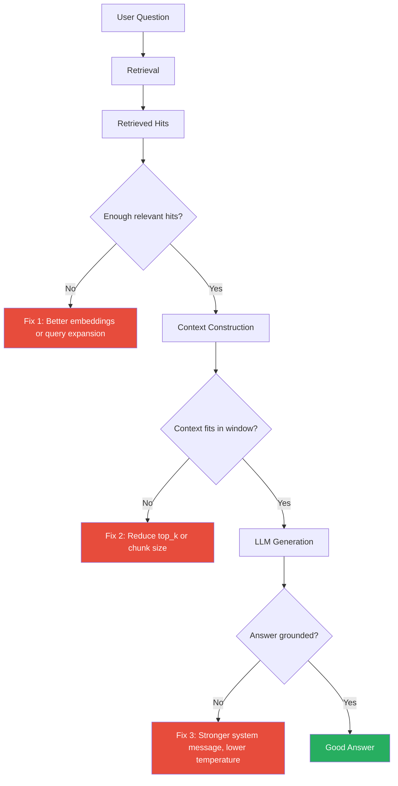

# RAG Failure Modes

Even well-implemented RAG systems can fail. Understanding these failure modes
is critical for building reliable GenAI applications.

## Common Failure Modes

### 1. No Relevant Documents Retrieved

**Symptom**: The LLM responds with "I don't know" or hallucinates.

```text
Question: "What is the revenue of AcmeCorp in 2024?"
Retrieved: [] (empty results)
LLM Output: "AcmeCorp's 2024 revenue was $50 million." (hallucination!)
```

**Causes**:
- Knowledge base doesn't contain the information
- Query embedding doesn't match document embeddings well
- top_k too low
- Poor chunking (relevant info split across chunks)

**Fixes**:
- Increase `top_k`
- Improve embedding quality
- Add a "no results" fallback response
- Use query expansion

### 2. Relevant but Incomplete Documents

**Symptom**: Answer is partially correct but missing key details.

```text
Question: "How do I configure SSL for the API?"
Retrieved: Chunks about SSL certificates but not the API configuration steps.
LLM: "You need an SSL certificate." (missing the actual steps)
```

**Causes**:
- Chunks too small (context cut off)
- Chunk boundary splits important information
- Document doesn't cover the specific question

**Fixes**:
- Increase chunk_size
- Reduce chunk_overlap trade-off
- Ensure documents are comprehensive before ingestion

### 3. Irrelevant Documents Retrieved (Noise)

**Symptom**: The LLM is confused by irrelevant information.

```text
Question: "How to deploy a Flask app?"
Retrieved chunks include: "Flask is a micro web framework...", 
                            "Docker containers package applications...",
                            "AWS Lambda runs serverless functions..."
LLM Output: A confused mix of deployment options
```

**Causes**:
- Embedding model returns false positives
- top_k too high (too much noise)
- No score filtering

**Fixes**:
- Filter by minimum similarity score
- Reduce top_k
- Use a better embedding model
- Re-rank results with a cross-encoder

### 4. Contradictory Documents

**Symptom**: The LLM sees conflicting information and gets confused.

```text
Context: "The API uses JSON format." (Source 1)
Context: "The API uses XML format." (Source 2)
LLM: "The API uses JSON, though XML is also supported." (confused)
```

**Causes**:
- Documents are outdated or contradictory
- No document versioning
- Multiple documents about the same topic with different info

**Fixes**:
- Filter by document recency (metadata)
- Deduplicate overlapping chunks
- Version documents and only ingest the latest

### 5. Prompt Too Long (Context Overflow)

**Symptom**: LLM ignores parts of the context or errors.

```text
Context: 10,000 tokens of chunks
Question: "What is X?"
→ Context exceeds the model's context window!
```

**Causes**:
- top_k too high
- Chunks too large
- No truncation

**Fixes**:
- Truncate context to fit token budget
- Use a model with larger context window
- Reduce chunk_size and top_k

### 6. LLM Ignores Context (Hallucinates)

**Symptom**: LLM generates facts not in the context.

```text
Context: "The meeting is at 3 PM."
LLM: "The meeting is scheduled for 2 PM tomorrow."
```

**Causes**:
- System message doesn't ground the LLM to context
- Temperature too high (too creative)
- Context poorly formatted

**Fixes**:
- Strong system message: "Answer using ONLY the context"
- Lower temperature (0.2-0.5)
- Clear context delimiters

## Diagnosing Failures

### 1. Check Retrieval Quality

```bash
# Use the demo endpoint to inspect what was retrieved
GET /api/v1/rag/demo?question=...

# Look at:
# - Scores of retrieved chunks (low scores = poor retrieval)
# - Whether the right documents were found
# - Context length vs. token budget
```

### 2. Score Analysis

```python
# Log similarity score distributions
logger.info("Retrieved scores: %s", [h.score for h in hits])

# If all scores are low (< 0.3), retrieval likely failed
```

### 3. A/B Test Prompts

Try different system messages and prompt formats to see which work best
for your specific use case.

## Visualization: Failure Mode Diagnosis



## Mitigation Strategies

### 1. Retrieval Confidence Scoring

```python
def should_answer(hits: list[SearchHit], threshold: float = 0.5) -> bool:
    """Only answer if the top hit has sufficient confidence."""
    if not hits:
        return False
    return hits[0].score >= threshold
```

### 2. Groundedness Checking

After generating an answer, check if it's supported by the context (either
by the LLM itself or a separate verification model).

### 3. Fallback to LLM-only

If retrieval fails, fall back to the LLM's training knowledge — but
clearly indicate the answer may not be up-to-date.

### 4. Re-ranking

Use a cross-encoder model to re-rank retrieved results:

```python
# Cross-encoder: takes (query, document) pairs and scores relevance
scores = cross_encoder.predict([(question, hit.text) for hit in hits])
# Re-sort hits by cross-encoder scores
```

## Monitoring

Track these metrics to catch failures early:

| Metric | What it tells you |
|--------|-------------------|
| **Hit rate @ K** | Fraction of queries with ≥1 relevant result |
| **Score distribution** | Are retrieved scores consistently low? |
| **Context length** | Are you hitting token limits? |
| **Answer confidence** | Does the LLM hedge or refuse? |
| **Hallucination detection** | Do answers contain info not in context? |

## Next Steps

- [Improving RAG](improving-rag.md) — Techniques to address these failures
- [Context Construction](context-construction.md) — Managing context quality
