# Improving RAG

This POC implements **naive RAG** — the simplest possible version. Here are
ways to improve it for production use.

## 1. Better Embeddings

### Current: all-MiniLM-L6-v2 (384 dims)
Fast, free, good for learning.

### Upgrade Options

| Model | Dimensions | Quality | Cost | When to Upgrade |
|-------|-----------|---------|------|-----------------|
| all-mpnet-base-v2 | 768 | Better | Free | Need higher recall |
| text-embedding-3-small | 1536 | Good | Paid | Production quality |
| text-embedding-3-large | 3072 | Best | Paid | High-stakes retrieval |
| BGE (bge-en) | 1024 | Excellent | Free | Open-source SOTA |

### Hybrid Embeddings

Combine dense embeddings (semantic) with sparse embeddings (keyword):

```python
# Dense: captures meaning
dense = embedding_model.encode("neural networks")

# Sparse: captures keywords
sparse = sparse_encoder("neural networks")  # e.g., SPLADE

# Combined score in search
final_score = alpha * dense_score + (1 - alpha) * sparse_score
```

## 2. Query Expansion

### The Problem

Users search with different words than the documents use:

```mermaid
flowchart LR
    Q["Query: \"How to fix a flat tire?\""] --> EMB["Query Embedding<br/>(captures semantic meaning)"]
    EMB --> VS["Vector Search<br/>vs. stored document embeddings"]
    VS --> R1["Doc: \"Changing a bicycle inner tube\""<br/>Score: 0.42 (low)"]
    VS --> R2["Doc: \"Car maintenance basics\""<br/>Score: 0.38"]
    VS --> R3["Doc: \"Bicycle repair guide\""<br/>Score: 0.75"]
    Q -->|Exact keyword match| KW["Keyword Search<br/>matches \"tire\", \"flat\", \"fix\""]
    KW --> R4["Doc: \"Bicycle tire replacement\""<br/>Score: 0.88 (high)"]

    style Q fill:#3498db,color:#fff
    style EMB fill:#9b59b6,color:#fff
    style VS fill:#e74c3c,color:#fff
    style R1 fill:#f39c12,color:#fff
    style R3 fill:#f39c12,color:#fff
    style KW fill:#8e44ad,color:#fff
    style R4 fill:#27ae60,color:#fff
```

### Solution: Query Expansion

```python
# Use the LLM to generate alternative queries
expand_prompt = f"""
Generate 3 alternative phrasings of this search query:
Query: "{question}"
Alternatives:
"""
# Then embed each and search
```

### Solution: Query Rewriting

```python
rewrite_prompt = f"""
Rewrite this search query to be more specific and searchable:
Original: "{question}"
Rewritten: """
```

## 3. Re-ranking

### The Problem

Initial retrieval finds candidates, but ranking may be off.

### Solution: Cross-Encoder Re-ranking

A cross-encoder takes (query, document) pairs and scores their relevance:

```python
from sentence_transformers import CrossEncoder

cross_encoder = CrossEncoder("cross-encoder/ms-marco-MiniLM-L-6-v2")

# Re-rank the top-K results
pairs = [(question, hit.text) for hit in hits]
scores = cross_encoder.predict(pairs)

# Combine with original scores
reranked = sorted(
    zip(hits, scores),
    key=lambda x: x[1],
    reverse=True
)
```

**Tradeoff**: Cross-encoders are slower (N×M comparisons) but much more accurate.

## 4. HyDE (Hypothetical Document Embeddings)

### The Technique

1. The LLM generates a hypothetical answer to the query
2. Embed the hypothetical answer (not the original query)
3. Search with the hypothetical embedding

```python
hyde_prompt = f"""
Please answer the following question:

Question: {question}

Answer:
"""

hypothetical = await llm.generate(hyde_prompt)
query_embedding = await embedding_service.embed(hypothetical)
# Search with the hypothetical answer's embedding
```

**Why it works**: The hypothetical answer is phrased more like a document,
so it matches documents better.

## 5. Better Chunking

### Current Approach: Fixed-size character splitting

### Improvements

| Strategy | Benefit |
|----------|---------|
| **Sentence-aware chunking** | Avoids cutting sentences mid-way |
| **Semantic chunking** | Uses embeddings to find natural breaks |
| **Sliding window with overlap** | (Already used) Preserves context across boundaries |
| **Content-type aware** | Different chunking for code, prose, tables |

### Semantic Chunking

```python
# Group sentences that are semantically related
def semantic_chunk(sentences, embedding_model, threshold=0.3):
    chunks = []
    current_chunk = [sentences[0]]
    current_embedding = embedding_model.encode(current_chunk[0])

    for sentence in sentences[1:]:
        sentence_embedding = embedding_model.encode(sentence)
        similarity = cosine_similarity(current_embedding, sentence_embedding)
        if similarity > threshold:
            current_chunk.append(sentence)
        else:
            chunks.append(" ".join(current_chunk))
            current_chunk = [sentence]
            current_embedding = sentence_embedding

    return chunks
```

## 6. Adaptive top-K and Context Window Management

### Dynamic top-K

```python
async def adaptive_retrieval(question, max_context_tokens=4000):
    k = 5
    while k <= 50:
        hits = await retrieve(question, top_k=k)
        context = build_context(hits)
        token_count = count_tokens(context + question)
        if token_count + 512 < max_context_tokens:
            return hits  # Fits in context window
        k += 5
    return hits  # Return what we have even if truncated
```

## 7. Multi-Vector Search

Store multiple embeddings per chunk:

- **Dense embedding**: Full text embedding
- **Sparse embedding**: Keyword-based embedding
- **Summary embedding**: Summary of the chunk

Search all and merge results.

## 8. Feedback Loop

Collect user feedback to improve retrieval:

```python
# Track: question → retrieved_docs → answer → thumbs up/down
# Use feedback to:
# - Re-rank certain documents higher
# - Fine-tune the embedding model
# - Adjust chunking parameters
```

## 9. Caching

Cache frequent queries:

```python
from functools import lru_cache

@lru_cache(maxsize=1000)
def cached_rag_query(question: str, top_k: int = 5):
    return asyncio.run(rag_pipeline.query(RAGRequest(question=question, top_k=top_k)))
```

## 10. Evaluation

Measure RAG quality with:

| Metric | What it measures |
|--------|-----------------|
| **Context precision** | How relevant retrieved docs are |
| **Context recall** | How much of the relevant info was retrieved |
| **Answer faithfulness** | Whether answer matches the context |
| **Answer relevancy** | Whether answer addresses the question |

## Where Our POC Stands

```mermaid
graph TD
    Naive["Naive RAG (our POC)"]
    Advanced["Advanced RAG (improvements above)"]

    subgraph "Naive RAG — Current Implementation"
        N1["Fixed-size chunking<br/>500 chars, 100 overlap"]
        N2["Single embedding model<br/>all-MiniLM-L6-v2 (384-dim)"]
        N3["Basic top-K retrieval<br/>k=5, cosine similarity"]
        N4["Single prompt<br/>static system + user message"]
    end

    subgraph "Advanced RAG — Recommended Improvements"
        A1["Semantic chunking<br/>context-aware boundaries"]
        A2["Query expansion + HyDE<br/>multiple query variants"]
        A3["Cross-encoder re-ranking<br/>more accurate relevance"]
        A4["Adaptive top-K<br/>dynamic based on context length"]
        A5["Feedback loop<br/>collect user ratings, retrain"]
        A6["Caching<br/>avoid repeated queries"]
    end

    Naive --> N1
    Naive --> N2
    Naive --> N3
    Naive --> N4

    Advanced --> A1
    Advanced --> A2
    Advanced --> A3
    Advanced --> A4
    Advanced --> A5
    Advanced --> A6

    style Naive fill:#e74c3c,color:#fff
    style Advanced fill:#27ae60,color:#fff
    style N1 fill:#bdc3c7,color:#333
    style N2 fill:#bdc3c7,color:#333
    style N3 fill:#bdc3c7,color:#333
    style N4 fill:#bdc3c7,color:#333
    style A1 fill:#bdc3c7,color:#333
    style A2 fill:#bdc3c7,color:#333
    style A3 fill:#bdc3c7,color:#333
    style A4 fill:#bdc3c7,color:#333
    style A5 fill:#bdc3c7,color:#333
    style A6 fill:#bdc3c7,color:#333
```



## Next Steps

- Start with our POC's basic RAG — understand the flow
- Compare results with and without context (to measure RAG's value)
- Experiment with different chunk sizes and top-K values
- Review the [RAG Failure Modes](failure-modes.md) for troubleshooting
