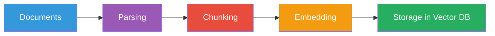

# Document Ingestion

Document ingestion is the first step of the RAG pipeline: taking raw documents
and preparing them for search in a vector database.

## The Ingestion Flow



## Step 1: Document Sources

Documents can come from many places:

| Source | Format | Typical Parser |
|--------|--------|----------------|
| Web pages | HTML | `requests` + `BeautifulSoup` |
| PDF files | PDF | `PyPDF2`, `pdfplumber` |
| Word docs | .docx | `python-docx` |
| Text files | .txt | Built-in `open()` |
| Markdown | .md | Built-in or `markdown` |
| JSON data | JSON | `json` module |
| Database records | SQL | Database driver |
| APIs | JSON/XML | `requests` |

### In Our POC

For simplicity, the POC accepts documents as plain text:

```python
# app/models/schemas.py
class Document(BaseModel):
    id: str | None = None
    content: str = Field(..., description="Full text content")
    metadata: dict[str, Any] = Field(default_factory=dict)
```

```python
# Submit via API
{
  "documents": [
    {
      "content": "Machine learning is a subset of AI...",
      "metadata": {"category": "AI", "source": "lecture_notes"}
    }
  ]
}
```

## Step 2: Parsing

**Parsing** converts a file or blob into clean text.

For a real system, you'd handle:
- Stripping HTML tags from web pages
- Extracting text from PDFs (handling multi-column layouts, images)
- Handling encoding issues

```python
# Example: extracting text from a PDF
import PyPDF2

def pdf_to_text(path: str) -> str:
    reader = PyPDF2.PdfReader(path)
    text = ""
    for page in reader.pages:
        text += page.extract_text() + "\n"
    return text
```

### Parsing Challenges

1. **Layout preservation**: Tables, code blocks may need special handling
2. **Encoding**: Different files may use different encodings
3. **Noise removal**: Remove headers, footers, page numbers
4. **Structure**: Preserve headings, lists, sections

## Step 3: Chunking

See [Chunking Strategies](chunking.md) for a detailed explanation.

### In Our POC

```python
# app/rag/ingestion.py
def chunk_text(text: str, chunk_size: int = 500, chunk_overlap: int = 100) -> list[str]:
    """Split text into overlapping chunks."""
    if len(text) <= chunk_size:
        return [text]

    chunks = []
    start = 0
    while start < len(text):
        end = start + chunk_size
        chunks.append(text[start:end])
        start = end - chunk_overlap
    return chunks
```

## Step 4: Embedding Generation

Each chunk is converted to a vector using an embedding model:

```python
# app/embeddings/service.py
async def embed(self, text: str) -> list[float]:
    return await self.backend.embed(text)

# Batch embedding during ingestion
async def embed_many(self, texts: list[str]) -> list[list[float]]:
    return await self.backend.embed_many(texts)
```

### Why Batch?

- Faster (single API call for many texts)
- Better rate limit utilization
- Lower per-chunk cost

## Step 5: Storage in Vector Database

Embeddings and their associated metadata are stored:

```python
# app/services/vectordb.py
async def upsert_chunks(self, chunks: list[Chunk], embeddings: list[list[float]]) -> int:
    points = []
    for chunk, vector in zip(chunks, embeddings):
        payload = {
            "text": chunk.text,
            "document_id": chunk.document_id,
            "chunk_index": chunk.chunk_index,
            **chunk.metadata,
        }
        points.append(PointStruct(
            id=chunk.id,
            vector=vector,
            payload=payload,
        ))
    self.client.upsert(collection_name=self._collection, points=points)
```

## Complete Ingestion in Our POC

```python
# app/rag/ingestion.py
async def ingest_documents(documents, vector_db_service, embedding_service):
    # 1. Ensure collection exists
    await vector_db_service.create_collection()

    # 2. Chunk all documents
    all_chunks = []
    for doc in documents:
        all_chunks.extend(chunk_document(doc))

    # 3. Embed all chunks (batch)
    texts = [c.text for c in all_chunks]
    embeddings = await embedding_service.embed_many(texts)

    # 4. Store in vector DB
    await vector_db_service.upsert_chunks(all_chunks, embeddings)

    return len(documents), len(all_chunks)
```

## Ingestion API Endpoint

```bash
# POST /api/v1/rag/ingest
curl -X POST http://localhost:8000/api/v1/rag/ingest \
  -H "Content-Type: application/json" \
  -d '{
    "documents": [
      {
        "content": "Machine learning is a subset of AI...",
        "metadata": {"category": "AI", "topic": "ML"}
      }
    ]
  }'
```

Response:
```json
{
  "documents_processed": 1,
  "chunks_created": 3,
  "collection": "genai-documents"
}
```

## Best Practices

1. **Track document versions** — re-ingest when source documents change
2. **Use deterministic IDs** — so you can update/delete specific chunks
3. **Batch embedding calls** — cost efficiency
4. **Handle failed chunks** — log and skip problematic documents
5. **Validate before storing** — check embedding dimensions match collection

## Next Steps

- [Chunking Strategies](chunking.md)
- [Retrieval](retrieval.md)
