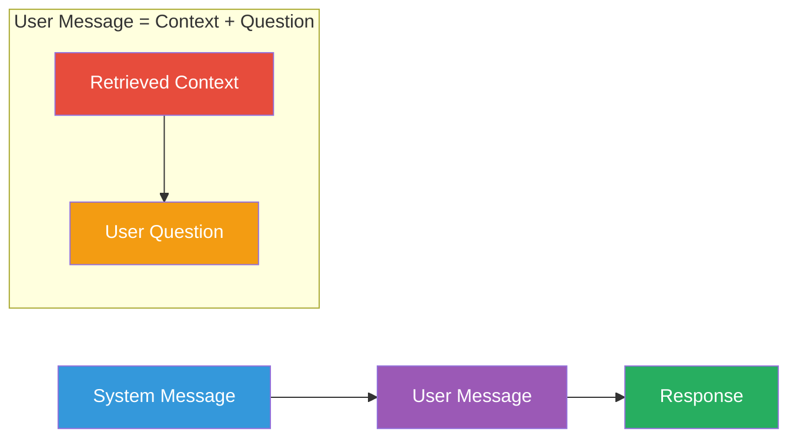

# Prompt Construction

The final prompt to the LLM is where retrieval meets generation. How you
construct the prompt determines how well the LLM uses the retrieved context.

## The Prompt Structure

A RAG prompt has three parts:



## System Message

The system message defines the assistant's role and constraints:

### Good System Message for RAG

```python
system = """You are a helpful assistant that answers questions based on the 
provided context. If you cannot answer the question from the context, 
say so honestly. Do not make up facts that are not supported by the context.
Cite the source numbers from the context when you use them."""
```

### Key Elements

1. **Role definition**: "You are a helpful assistant"
2. **Grounding instruction**: "Answer based on the provided context"
3. **Fallback behavior**: "Say so honestly" if context is insufficient
4. **Truthfulness constraint**: "Do not make up facts"
5. **Citation requirement**: "Cite the source numbers"

## User Message (Context + Question)

### Template Structure

```python
user_prompt = f"""Context:
{context}

Question: {question}

Answer:"""
```

### Variations

#### Option 1: Explicit Context Label

```text
Context:
[Source 1] Machine learning is a method...
---
[Source 2] Supervised learning uses labeled data...

Question: What is the difference between supervised and unsupervised learning?

Answer:
```

#### Option 2: XML-like Tags

```text
<context>
{context}
</context>

<question>
{question}
</question>
```

#### Option 3: Instruction First

```text
Answer the following question using only the context provided.
If you cannot answer, say "I don't know."

Context:
{context}

Question: {question}
```

## In Our POC

```python
# app/rag/retrieval.py
def build_rag_prompt(question: str, context: str) -> str:
    system_prompt = """You are a helpful assistant that answers questions 
    based on the provided context. If you cannot answer the question from 
    the context, say so honestly. Do not make up facts that are not 
    supported by the context."""

    if context:
        user_prompt = f"""Context:
{context}

Question: {question}

Answer:"""
    else:
        system_prompt = """You are a helpful assistant."""
        user_prompt = f"Question: {question}\n\nAnswer:"

    return f"{system_prompt}\n\n{user_prompt}"
```

```python
# app/rag/generation.py
messages = [
    ChatMessage(
        role=MessageRole.SYSTEM,
        content="You are a helpful assistant that answers questions based on the provided context..."
    ),
    ChatMessage(
        role=MessageRole.USER,
        content=f"Context:\n{context}\n\nQuestion: {question}\n\nAnswer:"
    ),
]
```

## Prompt Design Principles

### 1. Keep Instructions Clear

```python
# ❌ Unclear
"You are smart."

# ✅ Clear
"You are a helpful assistant that answers questions using only the provided context."
```

### 2. Specify What to Do When Context is Insufficient

```python
# Always include a fallback instruction
"If you cannot answer the question from the context, say so honestly."
```

### 3. Specify Output Format When Needed

```python
system = "Answer in 3 bullet points."
# or
system = "Return your answer as valid JSON with keys: answer, sources."
```

### 4. Use Delimiters

Delimiters help the model parse the prompt structure:

```python
user_prompt = f"""{context}
---
Question: {question}

Answer:"""
```

### 5. Put Critical Instructions Early

Some models weigh the beginning of the prompt more heavily (recency/position bias).
Place key constraints in the system message.

## Context Token Management

### Calculating Remaining Tokens

```python
def get_remaining_tokens(context: str, question: str, model: str = "gpt-3.5-turbo") -> int:
    """Estimate remaining tokens for the LLM response."""
    import tiktoken
    encoder = tiktoken.encoding_for_model(model)
    context_tokens = len(encoder.encode(context))
    question_tokens = len(encoder.encode(question))
    # gpt-3.5-turbo has 4096 token window
    return 4096 - context_tokens - question_tokens - 100  # 100 buffer
```

### Dynamic Context Sizing

If the context is too large, reduce it:

```python
max_tokens = get_remaining_tokens(context, question)
if max_tokens < 100:
    # Context is too large — reduce top_k or chunk size
    context = truncate_context(context, max_chars=1500)
```

## Advanced Prompt Patterns

### Multi-Query Retrieval

Generate multiple query variations and merge results:

```python
queries = [
    "What is machine learning?",
    "Define machine learning",
    "Machine learning meaning",
]
# Retrieve for each, deduplicate, re-rank
```

### Query Reformulation

Use the LLM to rewrite the query for better retrieval:

```python
reformulated_prompt = f"""
Rewrite the following query to be more specific and searchable:

Original: "{question}"
Rewritten: """
```

### Self-Ask Prompting

The LLM can decompose complex queries:

```python
prompt = """
Answer step by step:
1. What sub-questions need to be answered?
2. Search for each.
3. Combine into a final answer.
"""
```

## Demo Endpoint

The POC includes a demo endpoint that shows the prompt without calling the LLM:

```bash
# GET /api/v1/rag/demo?question=What is machine learning?
{
  "prompt": "You are a helpful assistant...\n\nContext:\n[Source 1]...\n\nQuestion: What is machine learning?\n\nAnswer:",
  "context": "[Source 1] (score: 0.89)\n...",
  "retrieved_chunks": [...]
}
```

## Next Steps

- [RAG Failure Modes](failure-modes.md) — What goes wrong and how to fix it
- [Improving RAG](improving-rag.md) — Techniques for better results
