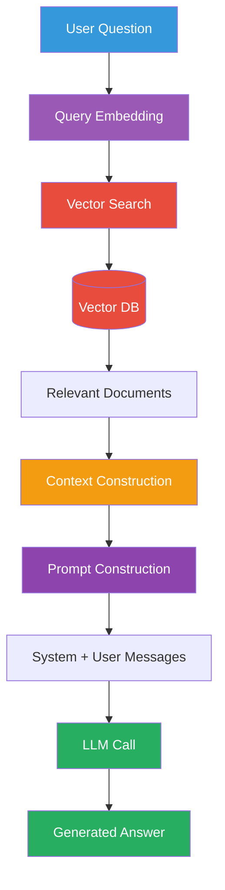
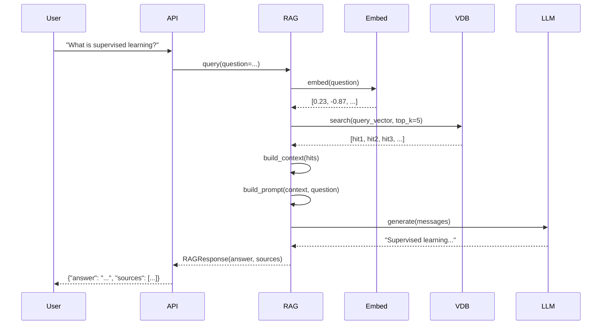

# The Complete RAG Flow

This page walks through the entire RAG pipeline step by step, from a user's
question to a grounded answer.

## Full Flow



## Step 1: User Question

```
"What is the difference between supervised and unsupervised learning?"
```

## Step 2: Query Embedding

The user's question is converted into a vector using the same embedding model
used during document ingestion.

```python
# app/embeddings/service.py
query_embedding = await embedding_service.embed(question)
# → [0.23, -0.87, 0.45, 0.12, ...]  (384 dimensions)
```

**Why**: The embedding captures the *semantic meaning* of the question,
enabling similarity-based retrieval.

## Step 3: Vector Search

The query embedding is compared against all stored document embeddings using
approximate nearest-neighbor (ANN) search.

```python
# app/services/vectordb.py
hits = await vector_db.search(
    query_vector=query_embedding,
    top_k=5,  # Return 5 most similar chunks
)
```

**What happens inside Qdrant**:
1. The HNSW index navigates the graph of document vectors
2. It finds vectors closest to the query vector (by cosine similarity)
3. Returns the top-5 with similarity scores

## Step 4: Relevant Documents (Retrieved Context)

The search returns ranked document chunks:

```python
# Example results
hits = [
    SearchHit(id="chunk_1", score=0.89, text="Supervised learning uses labeled data..."),
    SearchHit(id="chunk_3", score=0.82, text="In supervised learning, the model..."),
    SearchHit(id="chunk_2", score=0.75, text="Unsupervised learning finds patterns..."),
    ...
]
```

Each hit includes:
- **Score**: Similarity score (higher = more relevant)
- **Text**: The chunk content
- **Metadata**: Document ID, category, etc.

## Step 5: Context Construction

The retrieved chunks are assembled into a single context string.

```python
# app/rag/retrieval.py
def build_context(hits: list[SearchHit], max_chars: int = 3000) -> str:
    parts = []
    for i, hit in enumerate(hits):
        snippet = f"[Source {i + 1}] (score: {hit.score:.4f})\n{hit.text}"
        parts.append(snippet)
    return "\n---\n".join(parts)
```

The context includes source numbers so the LLM can cite them:
```
[Source 1] (score: 0.8923)
Supervised learning uses labeled data...

---
[Source 2] (score: 0.8210)
In supervised learning, the model receives...
```

## Step 6: Prompt Construction

The context and question are combined into a prompt with proper message roles:

```python
# app/rag/generation.py
messages = [
    ChatMessage(
        role=MessageRole.SYSTEM,
        content="You are a helpful assistant that answers questions based on the provided context.",
    ),
    ChatMessage(
        role=MessageRole.USER,
        content=f"Context:\n{context}\n\nQuestion: {question}\n\nAnswer:",
    ),
]
```

### Why This Structure?

| Message | Purpose |
|---------|---------|
| **System** | Sets behavior — "answer using only the context" |
| **User** (with context) | Contains the knowledge the LLM needs |
| **User** (with question) | The actual question to answer |

## Step 7: LLM Call

The constructed messages are sent to the LLM:

```python
# app/llm/service.py
response = await client.chat.completions.create(
    model=settings.llm_model,
    messages=[{"role": "system", "content": system_prompt},
              {"role": "user", "content": user_prompt}],
    temperature=0.7,
    max_tokens=1024,
)
```

The LLM sees:
1. The instruction to be a helpful assistant
2. The retrieved context (knowledge from the vector DB)
3. The user's question

## Step 8: Generated Answer

```python
# Response
answer = "Supervised learning uses labeled data... Unsupervised learning..."
sources = hits  # Original retrieved chunks
context = context  # The assembled context string
```

## Visual Walkthrough Example



## In Our POC

The complete pipeline in one method:

```python
# app/rag/pipeline.py
async def query(self, request: RAGRequest) -> RAGResponse:
    # Step 1-3: Retrieve
    hits = await self.retrieve(question=request.question, top_k=request.top_k)

    # Step 4-5: Build context
    context = build_context(hits)

    # Step 6-7: Generate
    response = await generate_answer(
        question=request.question,
        hits=hits,
        llm_service=self.llm,
    )

    # Step 8: Return
    return response
```

## Key Insights

1. **Same embedding model** must be used for documents and queries
2. **Context window limits** — the assembled context + question must fit
   within the LLM's token limit
3. **Scores are relative** — a score of 0.5 may still be relevant depending
   on the model and data
4. **No retrieval = no grounding** — if nothing is retrieved, the LLM falls
   back to its training data (potential hallucination)

## Next Steps

- [Document Ingestion](ingestion.md)
- [Chunking](chunking.md)
- [Retrieval](retrieval.md)
- [Context Construction](context-construction.md)
- [Prompt Construction](prompt-construction.md)
