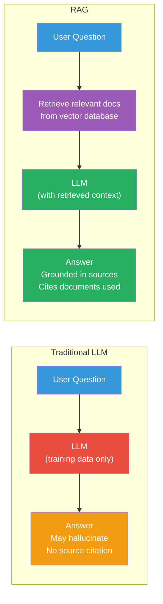
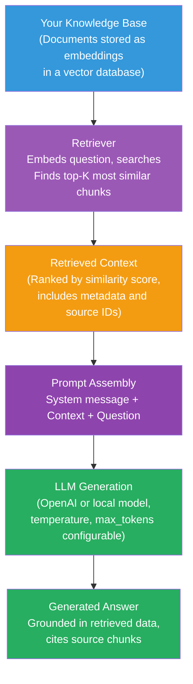
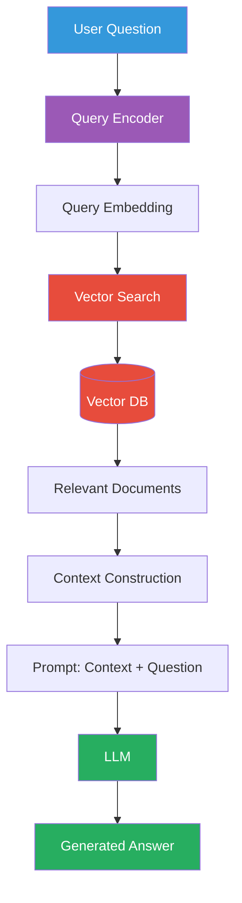
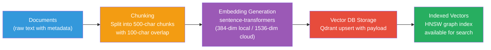
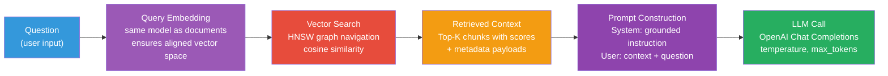

# What is RAG?

## Retrieval-Augmented Generation (RAG)

**RAG** combines two capabilities:

1. **Retrieval**: Search a knowledge base for relevant information
2. **Generation**: Use an LLM to generate an answer grounded in that information



## Why RAG?

### The Problem with Pure LLMs

Large Language Models are trained on a fixed dataset. This creates several issues:

1. **Stale knowledge**: The model's knowledge has a cutoff date
2. **No source of truth**: You can't verify what the model "remembers"
3. **Hallucination**: The model may confidently state incorrect facts
4. **No access to private data**: The model wasn't trained on your documents
5. **Cost**: Larger models with more knowledge cost more per call

### How RAG Solves This



## The Complete RAG Architecture



## Key Components

| Component | Responsibility |
|-----------|----------------|
| **Document Store** | Source of truth (your documents, data) |
| **Chunking** | Split documents into manageable pieces |
| **Embedding Model** | Convert text → vectors |
| **Vector Database** | Store and search vectors |
| **Retriever** | Find relevant chunks for a query |
| **Context Builder** | Assemble retrieved chunks into a context block |
| **LLM** | Generate a final answer using context + question |
| **Prompt Template** | Structure the input to the LLM |

## The RAG Flow Step by Step

### Step 1: Document Ingestion

Before you can search, you need documents in your vector database.



### Step 2: Query Processing

When a user asks a question:



### Step 3: Answer Generation

The LLM uses the retrieved context to generate a relevant, grounded answer.

## Why "Augmented" Generation?

The key insight is that RAG **augments** the LLM's response with external
knowledge — it doesn't just rely on what the model memorized during training.

### Comparison

| Approach | Knowledge Source | Grounding | Cost |
|----------|-----------------|-----------|------|
| **Vanilla LLM** | Training data | None | Low |
| **Fine-tuning** | Training data + new data | Partial | High |
| **RAG** | External knowledge base | Strong | Medium |

## RAG vs. Fine-tuning

| Aspect | RAG | Fine-tuning |
|--------|-----|-------------|
| **Data addition** | Add documents to vector DB | Retrain model on new data |
| **Update cost** | Add/remove documents | Expensive retraining |
| **Explainability** | Can cite sources | Black box |
| **Knowledge scope** | Unlimited documents | Limited to training |
| **Real-time updates** | Instant | Takes days/weeks |
| **Best for** | Dynamic knowledge bases | Consistent style/domain shifts |

## Variants of RAG

### Naive RAG
- Simple: embed query, search, retrieve top-k, prompt LLM
- **This POC implements naive RAG** for learning clarity

### Advanced RAG (aRAG)
- Multiple retrieval passes
- Query expansion/reformulation
- Re-ranking of retrieved documents
- Self-critique of the final answer

### Modular RAG
- Separate components for ingestion, retrieval, and generation
- Easy to swap individual components
- **This POC follows the modular approach**

### Agentic RAG
- Uses an LLM agent to decide when/why to retrieve
- Can perform iterative retrieval
- Can call multiple tools

## Use Cases

| Use Case | How RAG Helps |
|----------|---------------|
| **Customer support bot** | Search knowledge base for relevant articles |
| **Document search** | Find specific information across many documents |
| **Code assistant** | Index codebase, retrieve relevant snippets |
| **Research assistant** | Search academic papers, summarize findings |
| **Chatbot with private data** | Ground responses in company documents |
| **News Q&A** | Search recent news articles by semantic relevance |

## In Our POC

The RAG pipeline ties together all components:

```python
# app/rag/pipeline.py
class RAGPipeline:
    async def query(self, request: RAGRequest) -> RAGResponse:
        # 1. Retrieve relevant context
        hits = await self.retrieve(
            question=request.question,
            top_k=request.top_k,
        )

        # 2. Generate answer using retrieved context
        response = await generate_answer(
            question=request.question,
            hits=hits,
            llm_service=self.llm,
        )

        return response
```

### API Endpoint

```
POST /api/v1/rag/query

Request:  {"question": "What is RAG?"}
Response: {"answer": "RAG stands for Retrieval-Augmented Generation...", "sources": [...]}
```

## Next Steps

- [The Complete RAG Flow](rag-flow.md) — Detailed walkthrough
- [Document Ingestion](ingestion.md) — How documents enter the system
- [Chunking](chunking.md) — Splitting documents effectively
- [Retrieval](retrieval.md) — Finding relevant context
