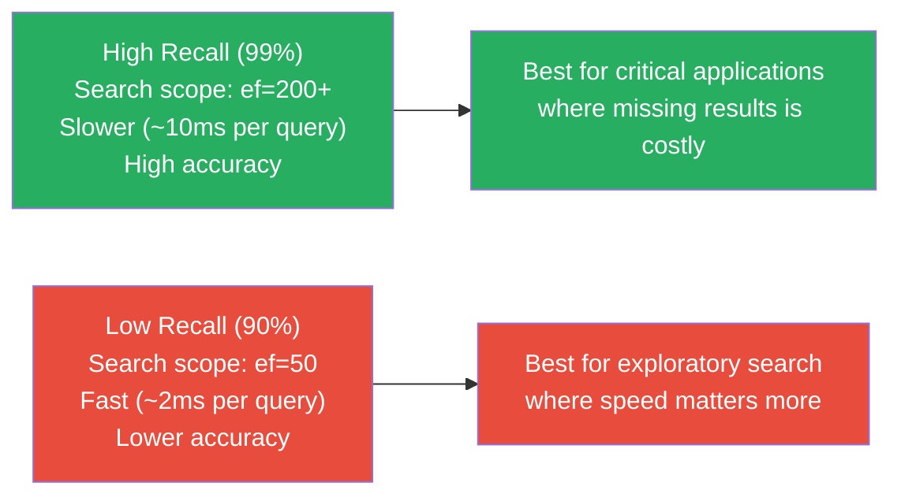
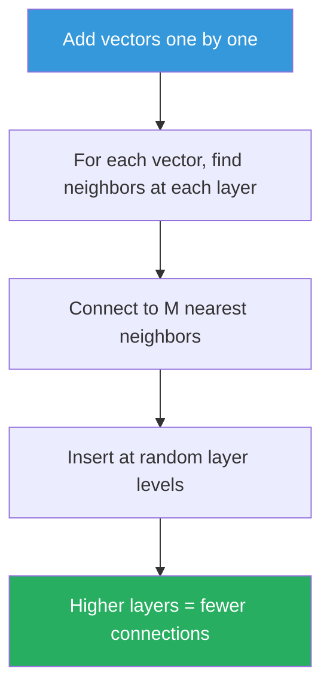
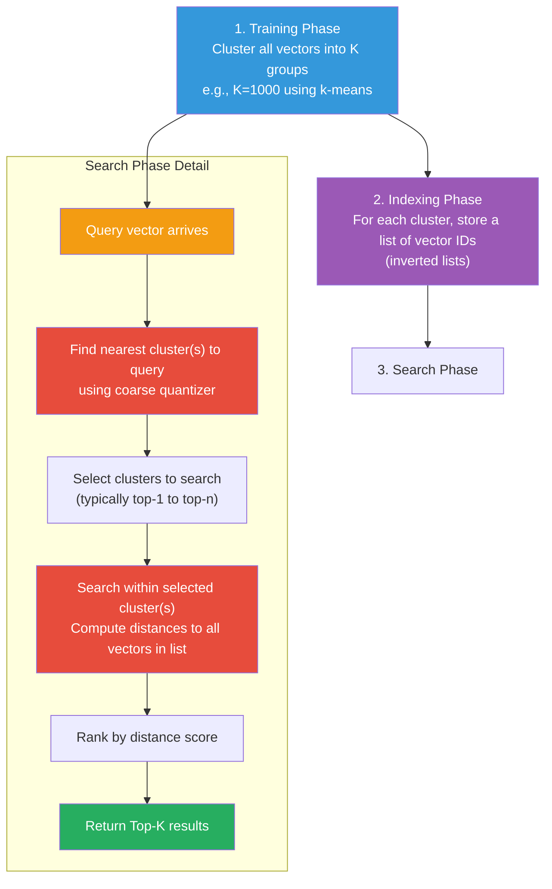
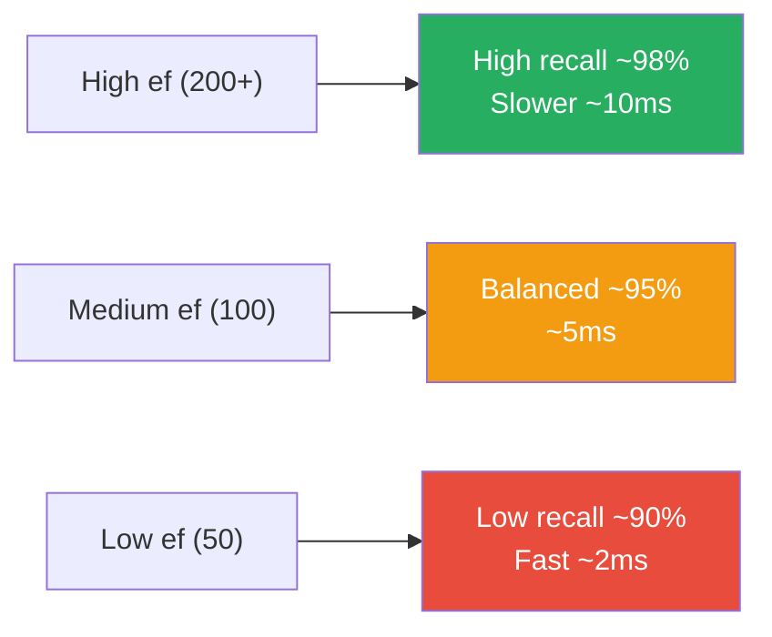

# Approximate Nearest Neighbor (ANN) Search

## Exact vs. Approximate Search

### Exact Search (Brute Force)

Compares the query vector against **every** vector in the database:

```python
# Exact approach — O(n) per query
def exact_search(vectors, query, k=5):
    distances = [cosine(query, v) for v in vectors]
    return sorted(range(len(distances)), key=lambda i: -distances[i])[:k]
```

- **Pros**: 100% accurate — always finds the true nearest neighbors
- **Cons**: O(n × d) per query — too slow for millions of vectors

### Approximate Search (ANN)

Uses indexing to skip most vectors, finding **approximately** nearest neighbors:

```python
# ANN approach — O(log n) per query with HNSW
def ann_search(hnsw_graph, query, k=5, ef=200):
    # Navigate the graph to find neighbors quickly
    return graph_search(hnsw_graph, query, k, ef)
```

- **Pros**: Fast — O(log n) to O(1) per query
- **Cons**: May miss some true neighbors (but usually by a small margin)

## The Recall/Speed Tradeoff



**Recall** = (found true neighbors / actual true neighbors)

For most applications, 95-98% recall is acceptable:
- Semantic search is already approximate (embeddings aren't perfect)
- Users don't notice a small number of missed results
- The speed gain is worth it

## How ANN Works: The HNSW Algorithm

### Step 1: Build the Graph



### Step 2: Search the Graph

```python
# Conceptual ANN search (HNSW)
def hnsw_search(graph, query, k, ef):
    # 1. Start at the top layer (sparse)
    entry = graph.entry_point
    
    # 2. Greedily descend — always move to the closest neighbor
    for layer in range(graph.max_layer, 0, -1):
        entry = greedy_search(graph, entry, query, layer)
    
    # 3. At the bottom layer, do a more thorough search
    #    Keep a candidate list of size `ef`
    candidates = beam_search(graph, entry, query, ef, layer=0)
    
    # 4. Return top-k from candidates
    return sorted(candidates, key=lambda v: distance(v, query))[:k]
```

### Key Parameters

| Parameter | Meaning | Effect |
|-----------|---------|--------|
| `ef` (search) | Candidate list size during search | Higher = better recall, slower |
| `M` (graph) | Max connections per node | Higher = better recall, more memory |
| `efConstruction` | Candidate size during build | Higher = better graph, slower build |

## Other ANN Methods

### IVF (Inverted File)



**Tradeoff**: Faster if clusters are well-separated, but you might search
in the wrong cluster.

### FAISS (Facebook AI Similarity Search)

A library (not a database) that provides multiple index types:

```python
import faiss

# Flat index (exact but fast on GPU)
index = faiss.IndexFlatIP(dimension)

# HNSW index (approximate)
index = faiss.IndexHNSWFlat(dimension, M=32)

# IVF index
quantizer = faiss.IndexFlatIP(dimension)
index = faiss.IndexIVFFlat(quantizer, dimension, nlist=100)
```

### Annoy (Spotify)

Tree-based, memory-mapped:
- Very fast to load (mmap)
- Multiple trees for better recall
- Read-only (no dynamic updates)

## ANN in Vector Databases

Each database uses different default strategies:

| Database | Default Index | Tunable? | Notes |
|----------|--------------|----------|-------|
| **Qdrant** | HNSW | Yes | `ef`, `M`, `efConstruction` |
| **Pinecone** | HNSW | Yes | `ef` at query time |
| **Weaviate** | HNSW | Yes | `ef`, `maxConnections` |
| **Milvus** | HNSW, IVF | Yes | Multiple options |
| **Chroma** | HNSW | Yes | `space` parameter |

## Configuring ANN Parameters

### Qdrant Example

```python
from qdrant_client.http import models

# At collection creation
client.recreate_collection(
    collection_name="docs",
    vectors_config=models.VectorParams(
        size=384,
        distance=models.Distance.COSINE,
        hnsw_config=models.HnswConfig(
            m=32,              # More connections → better recall
            ef_construct=200,  # Better graph → better recall
            full_swap_threshold=10000,
        ),
    ),
)

# At search time
results = client.search(
    collection_name="docs",
    query_vector=[...],
    with_payload=True,
    limit=5,
    search_params=models.SearchParams(
        hnsw_ef=100,  # Search scope: higher = better recall, slower
    ),
)
```

## Recall vs. Latency Tradeoff



## In Our POC

The POC uses Qdrant's default HNSW settings:

```python
# app/services/vectordb.py
# Default cosine distance triggers HNSW indexing
client.recreate_collection(
    collection_name=settings.qdrant_collection,
    vectors_config=VectorParams(
        size=settings.embedding_dimensions,
        distance=self._distance(),
    ),
)
```

For learning purposes, the POC doesn't expose ANN parameters directly —
you can experiment by modifying the Qdrant client calls.

## When to Use ANN vs. Exact

| Dataset Size | Use Case | Recommendation |
|--------------|----------|----------------|
| < 10,000 vectors | Development, testing | Exact (or default ANN) |
| 10K - 100K | Small production | ANN with high ef |
| 100K - 1M | Medium production | ANN (tune ef) |
| 1M+ | Large scale | ANN (optimize for speed/recall) |
