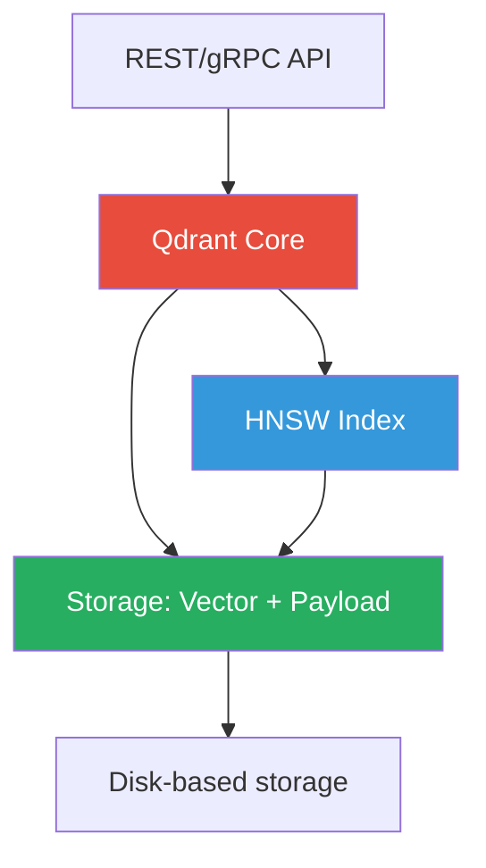

# Vector Database Comparison

This page compares the most commonly used vector databases so you can
make an informed choice for your own projects.

## Summary Comparison

| Database | Type | License | Hosting | Distance Metrics | Metadata Filter |
|----------|------|---------|---------|-----------------|-----------------|
| **Qdrant** | Native | Open-source | Self/hosted/cloud | Cosine, Euclid, Dot | ✓ |
| **Pinecone** | Native | Proprietary | Managed (cloud) | Cosine, Euclidean, Dot | ✓ |
| **Weaviate** | Native | Open-source | Self/hosted/cloud | Cosine, L2, Dot, custom | ✓ |
| **Milvus** | Native | Open-source | Self/hosted/cloud | Cosine, L2, IP, L1 | ✓ |
| **Chroma** | Native | Open-source | Self/integrated | L2, Cosine, IP | ✓ |
| **pgvector** | Extension | Open-source | Extension on Postgres | Cosine, L2, IP | ✓ (via SQL) |
| **Elasticsearch** | Extension | Open-source/SaaS | Self/SaaS | Cosine, L2 | ✓ |
| **OpenSearch** | Extension | Open-source | Self/SaaS | Cosine, L2 | ✓ |

## Detailed Comparison

### 1. Qdrant

**Architecture**: Native vector database written in Rust.



| Property | Details |
|----------|---------|
| **Architecture** | Standalone server (Rust) |
| **Storage model** | Vector + JSON payload (stored together) |
| **Indexing** | HNSW (default) |
| **Search** | k-NN, filtering, hybrid |
| **Filtering** | Rich boolean expressions on payload |
| **Deployment** | Docker, cloud (Qdrant Cloud), local |
| **Strengths** | Easy setup, great filtering, good docs, active community |
| **Limitations** | Less battle-tested at massive scale |
| **Use cases** | Prototypes, RAG, small-to-medium production |

**Python SDK**:
```python
from qdrant_client import QdrantClient
client = QdrantClient(url="http://localhost:6333")
```

### 2. Pinecone

**Architecture**: Managed cloud service (proprietary).

| Property | Details |
|----------|---------|
| **Architecture** | Fully managed cloud |
| **Storage model** | Vector + metadata |
| **Indexing** | HNSW, IVF, or disk-based (PODS) |
| **Search** | k-NN, filtering, sparse/dense hybrid |
| **Filtering** | Rich metadata filtering |
| **Deployment** | Managed (AWS, GCP, Azure) |
| **Strengths** | Zero-ops, scales automatically, excellent performance, serverless option |
| **Limitations** | Expensive at scale, vendor lock-in |
| **Use cases** | Production RAG, enterprise apps |

### 3. Weaviate

**Architecture**: GraphQL-native vector database with modular backends.

| Property | Details |
|----------|---------|
| **Architecture** | Standalone server (Go) with GraphQL + REST |
| **Storage model** | Objects with properties (schema-first) |
| **Indexing** | HNSW |
| **Search** | k-NN, BM25, hybrid (vector + keyword) |
| **Filtering** | GraphQL `where` filter / REST `where` |
| **Deployment** | Docker, cloud, Kubernetes |
| **Strengths** | GraphQL API, built-in LLM integration, schema-first |
| **Limitations** | Complex schema management, slower than Qdrant for simple use |
| **Use cases** | Knowledge graphs, GraphQL-first projects |

### 4. Milvus

**Architecture**: Purpose-built vector database (Go + C++).

| Property | Details |
|----------|---------|
| **Architecture** | Standalone / cluster (Kubernetes) |
| **Storage model** | Segment-based storage with WAL |
| **Indexing** | HNSW, IVF_FLAT, IVF_PQ, ANNOY, DISK_ANN |
| **Search** | k-NN, range search, hybrid |
| **Filtering** | Boolean expressions in query |
| **Deployment** | Docker, Kubernetes (Milvus Operator) |
| **Strengths** | Designed for massive scale (millions+ vectors), many index types |
| **Limitations** | Complex deployment, resource-heavy, steep learning curve |
| **Use cases** | Large-scale production, enterprise search |

### 5. Chroma

**Architecture**: Lightweight, developer-friendly vector store.

| Property | Details |
|----------|---------|
| **Architecture** | In-memory or persistent (Python) |
| **Storage model** | Embeddings + documents (simple) |
| **Indexing** | HNSW (via hnswlib) |
| **Search** | k-NN, filtering |
| **Filtering** | Simple key-value metadata filters |
| **Deployment** | Python library, REST API, Docker |
| **Strengths** | Extremely easy to use, integrates with LangChain, great for prototyping |
| **Limitations** | Not designed for massive scale, limited filtering |
| **Use cases** | Prototyping, local development, LangChain integration |

### 6. pgvector (PostgreSQL Extension)

**Architecture**: Extension that adds vector storage to PostgreSQL.

| Property | Details |
|----------|---------|
| **Architecture** | PostgreSQL extension |
| **Storage model** | VECTOR column type in regular tables |
| **Indexing** | IVFFlat (approximate) or exact (brute-force) |
| **Search** | k-NN via `<=>` operator |
| **Filtering** | Standard SQL `WHERE` clauses |
| **Deployment** | Add extension to any PostgreSQL instance |
| **Strengths** | Familiar SQL interface, transactional integrity, joins with relational data |
| **Limitations** | No HNSW (slower ANN), limited to PostgreSQL's ecosystem |
| **Use cases** | When you already use Postgres, need relational + vector hybrid queries |

### 7. Elasticsearch / OpenSearch Vector Search

**Architecture**: Full-text search engine with vector search plugin.

| Property | Details |
|----------|---------|
| **Architecture** | Lucene-based search engine |
| **Storage model** | Documents with dense_vector or knn_vector fields |
| **Indexing** | HNSW |
| **Search** | Hybrid: BM25 + k-NN, rescoring |
| **Filtering** | Standard query DSL |
| **Deployment** | Self-hosted, cloud (Elastic Cloud, AWS OpenSearch) |
| **Strengths** | Excellent text search + vector search, mature ecosystem, monitoring |
| **Limitations** | Vector storage less optimized than native VDBs |
| **Use cases** | When you need both text and vector search, e-commerce search |

## Feature Matrix

| Feature | Qdrant | Pinecone | Weaviate | Milvus | Chroma | pgvector | ES/OS |
|---------|--------|----------|----------|--------|--------|----------|-------|
| **Open Source** | ✓ | ✗ | ✓* | ✓ | ✓ | ✓ | ES: ✗, OS: ✓ |
| **Serverless** | ✗ | ✓ | ✗ | ✗ | ✗ | ✗ | ✗ |
| **Cloud Managed** | ✓ | ✓ | ✓ | ✓ | ✗ | ✗ | ✓ |
| **HNSW Index** | ✓ | ✓ | ✓ | ✓ | ✓ | ✗ | ✓ |
| **Multi-tenancy** | ✓ | ✓ | ✓ | ✓ | ✗ | SQL-based | ✓ |
| **Filtering** | Rich | Rich | Rich | Rich | Basic | SQL | Query DSL |
| **Hybrid Search** | Limited | ✓ | ✓ | Limited | Limited | Via JOIN | ✓ |
| **Transactions** | ✗ | ✗ | ✗ | ✗ | ✗ | ✓ (Postgres) | ✓ |
| **REST API** | ✓ | ✓ | ✓ | ✓ | ✓ | N/A | ✓ |
| **gRPC** | ✓ | ✗ | ✗ | ✓ | ✗ | N/A | ✗ |

\* Weaviate has an open-source core with commercial modules

## Choosing Guide

### For Learning / Prototyping

| Choice | Why |
|--------|-----|
| **Qdrant** | Simple Docker setup, good docs, flexible filtering — what this POC uses |
| **Chroma** | Zero-config, great with LangChain, simple Python API |
| **pgvector** | If you know SQL, just add an extension |

### For Production

| Scale | Choice | Why |
|-------|--------|-----|
| **Small-Medium** (10K-1M vectors) | Qdrant | Easy ops, good filtering |
| **Medium-Large** (100K-10M) | Pinecone, Milvus | Scales automatically, battle-tested |
| **Need text + vectors** | Elasticsearch/OpenSearch | Best hybrid search |
| **Already on Postgres** | pgvector | No new infrastructure |

## In Our POC

We use **Qdrant** because:

1. **Lightweight** — runs in a single Docker container
2. **Flexible filtering** — demonstrates metadata constraints
3. **Good Python SDK** — clear, simple API
4. **Open source** — no vendor lock-in
5. **HNSW indexing** — the standard ANN algorithm

The code is structured so switching to another database only requires
changing the `VectorDBService`:

```python
# app/services/vectordb.py
# The rest of the app talks to VectorDBService via these methods:
# - create_collection()
# - upsert_chunks()
# - search()
# To switch databases, swap the implementation of these methods.
```

## Next Steps

- [Using Qdrant](qdrant.md) — Hands-on with our chosen database
- [ANN Search](ann-search.md) — Understanding approximate search
