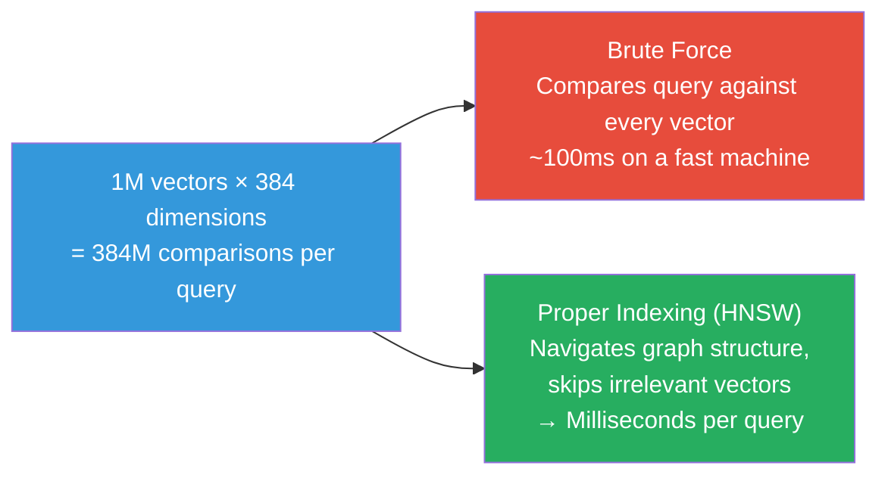
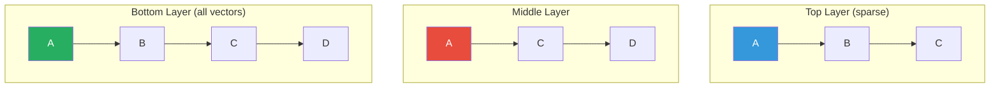
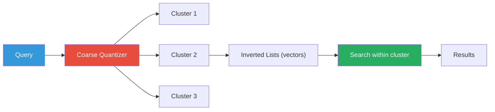
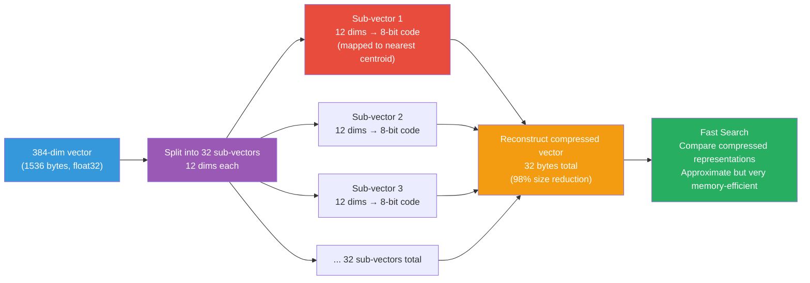
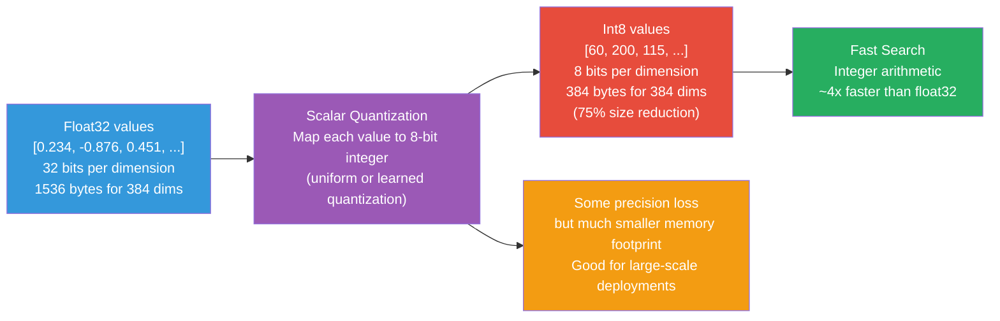
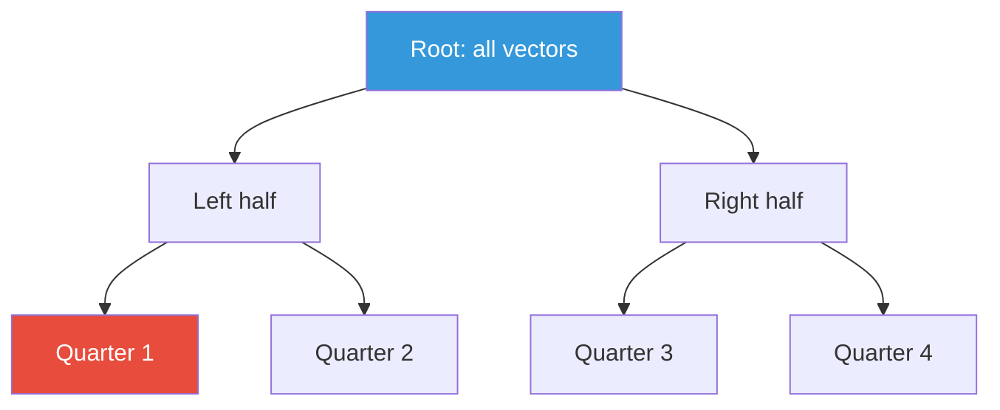

# Vector Indexing

## Why Indexing Matters

When you store millions of vectors, comparing a query against every single
vector (brute force) becomes prohibitively slow:



**Vector indexing** accelerates similarity search by organizing vectors so
the search algorithm can skip irrelevant regions of the vector space.

## Index Types

### 1. HNSW (Hierarchical Navigable Small World)

**What it is**: A graph-based index that builds multiple layers of connections
between vectors.



**How it works**:
1. Start at the top (sparsest) layer
2. Greedily move to the neighbor closest to the query
3. Descend to the next layer and repeat
4. Continue until reaching the bottom layer

**Pros**:
- Excellent recall (>95%)
- Fast search (O(log n))
- Dynamic (can add new vectors)

**Cons**:
- Higher memory usage (graph structure)
- Slower to build

### 2. IVF (Inverted File Index)

**What it is**: Clusters vectors into groups (Voronoi cells). At search time,
only search clusters near the query.



**How it works**:
1. **Training**: Cluster vectors into K clusters
2. **Indexing**: For each cluster, store a list of vector IDs
3. **Search**: Find the nearest clusters to the query, search only those

**Pros**:
- Lower memory than HNSW
- Good recall with proper parameter tuning
- Works well with scalar quantization

**Cons**:
- Requires training phase
- Less dynamic (additions require re-clustering)

### 3. Quantization Indexes

#### Product Quantization (PQ)

Compresses vectors by splitting them into sub-vectors and quantizing each:



**Pros**: Dramatically reduces memory usage
**Cons**: Lower accuracy (lossy compression)

#### Scalar Quantization

Simpler: quantize each dimension independently to 8 bits or less.



### 4. Tree-Based Indexes (Annoy)

**What it is**: Random projection trees that partition space.



**Pros**: Simple, memory-mapped (fast file-based loading)
**Cons**: Slower than HNSW for high-recall search

## Choosing an Index

| Index | Search Speed | Recall | Memory | Dynamic? | Best For |
|-------|-------------|--------|--------|----------|----------|
| **HNSW** | Very fast | 95-99% | High | Yes | General purpose |
| **IVF** | Fast | 90-98% | Medium | No | Memory-constrained |
| **PQ** | Fast | 80-90% | Very low | No | Massive scale |
| **Annoy** | Medium | 90-95% | Low | No | Static datasets |
| **Brute Force** | Slow | 100% | Low | Yes | Small datasets |

## Index Parameters

### HNSW Parameters

| Parameter | Description | Typical Value | Effect |
|-----------|-------------|---------------|--------|
| `M` | Max connections per node | 16, 32 | Higher M = better recall, more memory |
| `ef` | Search scope | 100-500 | Higher ef = better recall, slower search |
| `efConstruction` | Build scope | 100-500 | Higher = better graph, slower build |

### IVF Parameters

| Parameter | Description | Typical Value |
|-----------|-------------|---------------|
| `nlist` | Number of clusters | 100-1000 |

## In Our POC

Qdrant uses HNSW as the default index for cosine distance:

```python
# The collection is created with default HNSW indexing
client.recreate_collection(
    collection_name="my-collection",
    vectors_config=VectorParams(
        size=384,
        distance=Distance.COSINE,
    ),
)
```

You can configure HNSW parameters for precision/speed tradeoffs:

```python
# Custom HNSW configuration
vectors_config=VectorParams(
    size=384,
    distance=Distance.COSINE,
    hnsw_config=HnswConfig(
        m=32,              # More connections
        ef_construct=200,  # Better graph quality
    ),
)
```

## Build vs. Search Tradeoff

| Goal | Strategy |
|------|----------|
| **Fast searches** | Increase `ef` (search scope) |
| **Fast builds** | Decrease `efConstruction` |
| **Low memory** | Use quantization or IVF |
| **High recall** | Use HNSW with high `M` and `ef` |

## Next Steps

- [ANN Search](ann-search.md) — Deep dive into approximate nearest neighbors
