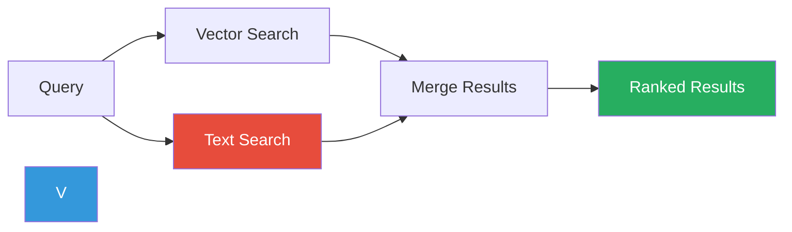
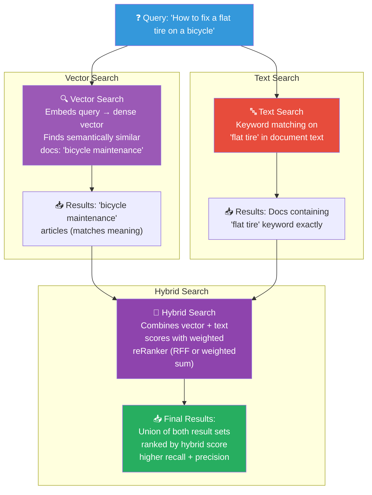

# Metadata & Filtering

## What is Metadata?

**Metadata** is structured data associated with each vector/document:

```json
{
  "vector": [0.23, -0.87, 0.45, ...],
  "payload": {
    "text": "The capital of France is Paris.",
    "document_id": "doc_001",
    "category": "geography",
    "language": "en",
    "published_date": "2024-01-15",
    "author": "John Doe"
  }
}
```

Each document isn't just a vector — it's a vector **plus** metadata that
describes who, what, when, where, and how.

## Why Filter?

Vector search finds **semantically similar** content. Metadata filtering
adds **precise constraints**:

```mermaid
flowchart TB
    Q["❓ Query: 'Tell me about French cuisine'"]

    subgraph "Without Metadata Filter"
        NO_FILTER["🔍 Pure Semantic Search<br/>Finds documents with similar<br/>meaning to the query"]
        BAD["⚠️ Results:<br/>French language docs about<br/>'language' not 'cuisine'<br/>(matches "French" semantically)"]
        NO_FILTER --> BAD
    end

    subgraph "With Metadata Filter"
        FILTER["🔎 Semantic Search + Filter<br/>category = cooking AND language = en<br"/>
        GOOD["✅ Results:<br/>English cooking documents<br/>about French cuisine only"]
        FILTER --> GOOD
    end

    Q --> NO_FILTER
    Q --> FILTER

    style Q fill:#3498db,color:#fff
    style NO_FILTER fill:#e74c3c,color:#fff
    style BAD fill:#e74c3c,color:#fff
    style FILTER fill:#9b59b6,color:#fff
    style GOOD fill:#27ae60,color:#fff
```

## Filtering Operators

Vector databases support rich filtering on metadata fields:

| Operator | Description | Example |
|----------|-------------|---------|
| `equals` / `match` | Exact match | `category = "tech"` |
| `in` | Value in a set | `category IN ["tech", "science"]` |
| `range` | Numeric/date range | `score > 0.5 AND score < 0.9` |
| `exists` | Field is present | `"author"` exists |
| `not exists` | Field is absent | `"deleted_at"` doesn't exist |
| `prefix` | String prefix match | `title` starts with "How" |
| `regex` | Regex match | `title` matches regex pattern |

## In Our POC

The vector DB service supports metadata filtering:

```python
# app/services/vectordb.py
async def search(
    self,
    query_vector: list[float],
    top_k: int = 5,
    filter_condition: dict[str, Any] | None = None,  # ← Metadata filter
) -> list[SearchHit]:
    search_filter = None
    if filter_condition:
        search_filter = rest.Filter(
            must=[
                rest.FieldCondition(
                    key=key,
                    match=rest.MatchValue(any=[val] if isinstance(val, list) else [val]),
                )
                for key, val in filter_condition.items()
            ]
        )

    results = self.client.search(
        collection_name=self._collection,
        query_vector=query_vector,
        query_filter=search_filter,  # ← Applied during search
        limit=top_k,
    )
```

### Usage Example

```python
# Store a document with metadata
document = Document(
    content="Python is a versatile programming language...",
    metadata={"category": "programming", "language": "en", "difficulty": "beginner"}
)

# Later, search with a filter
hits = await vector_db.search(
    query_vector=embedding,
    top_k=5,
    filter_condition={"category": "programming"},
)
```

## Hybrid Search

**Hybrid search** combines vector similarity search with keyword/text search
results:



### Why Hybrid?

| Search Type | Strengths | Weaknesses |
|-------------|-----------|------------|
| **Vector** | Semantic meaning, typo-tolerant | May miss exact keyword matches |
| **Text** | Exact matches, structured queries | Misses synonyms, paraphrases |
| **Hybrid** | Best of both worlds | More complex to implement |

### Hybrid Search Example



## Filtering Syntax Across Databases

### Qdrant

```python
search_filter = Filter(
    must=[
        FieldCondition(key="category", match=MatchValue(value="tech")),
        FieldCondition(key="score", range=Range(gte=0.7)),
    ],
    must_not=[
        FieldCondition(key="status", match=MatchValue(value="archived")),
    ],
)
```

### Pinecone

```python
filter = {
    "category": {"$eq": "tech"},
    "score": {"$gte": 0.7},
    "status": {"$ne": "archived"},
}
```

### Weaviate

```python
where_filter = {
    "path": ["category"], "valueText": "tech"
}
```

## Indexing Metadata

Metadata fields used for filtering should be **indexed** for fast lookups:

| Database | Index Metadata? | Default |
|----------|----------------|---------|
| Qdrant | Yes (all payload) | Auto |
| Pinecone | Yes (`metadata` is indexed) | Auto |
| Weaviate | Yes (explicit) | Configurable |
| Milvus | Yes (create index) | Manual |

## Best Practices

1. **Index frequently filtered fields** — category, tags, status
2. **Avoid indexing large text fields** — use keywords or categories instead
3. **Use structured metadata** — dates, categories, enums (not free text)
4. **Pre-filter before vector search** — narrow the search space
5. **Combine with scalar ranking** — filter results by metadata score + vector score

## In Our POC: Document Metadata

When ingesting documents, metadata is preserved in chunks:

```python
# app/rag/ingestion.py
class Chunk(BaseModel):
    id: str
    text: str
    document_id: str
    chunk_index: int
    metadata: dict[str, Any] = Field(default_factory=dict)
```

```python
# During ingestion, metadata is stored as payload
payload = {
    "text": chunk.text,
    "document_id": chunk.document_id,
    "chunk_index": chunk.chunk_index,
    **chunk.metadata,  # User-defined metadata
}
```
