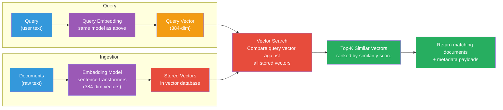
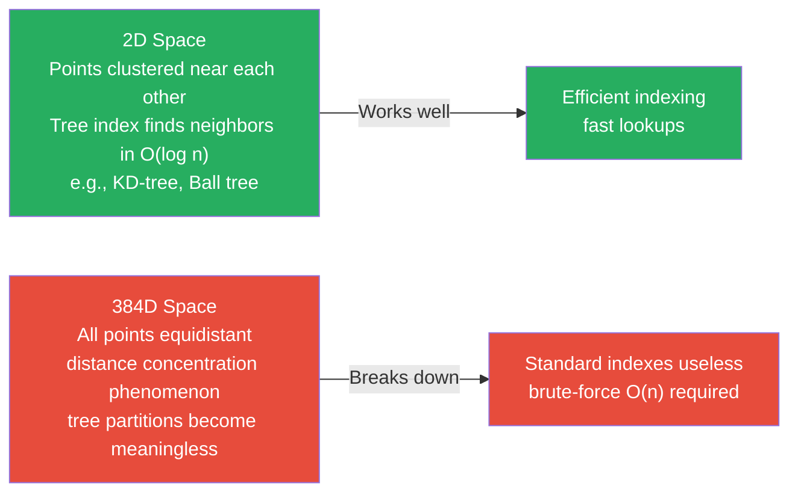
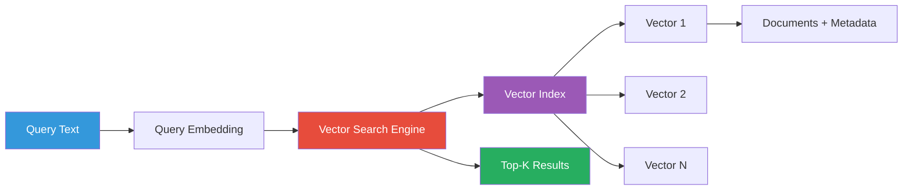
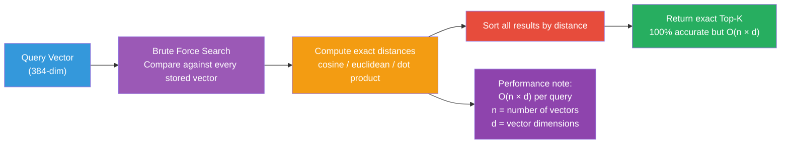
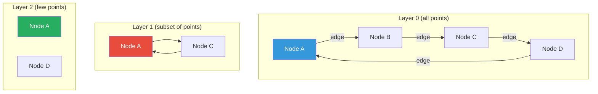

# What is a Vector Database?

## The Problem

Embedding models convert text into dense vectors (e.g., 384 numbers per text).
When you have thousands or millions of documents, you need to find which ones
are most similar to a query — fast.



### Why Not Just Use a Regular Database?

| Feature | Traditional DB | Vector DB |
|---------|---------------|-----------|
| **Search by** | Keywords, IDs | Semantic meaning (vectors) |
| **Index type** | B-trees, hash maps | HNSW, IVF, Annoy |
| **Distance** | Exact match | Approximate nearest neighbor |
| **Speed** | Fast exact lookup | Fast approximate search |
| **Scalability** | Good for exact queries | Designed for high-dimensional vectors |

### The Curse of Dimensionality

With high-dimensional vectors (384+ dimensions), traditional indexing methods
break down:



## What a Vector Database Does

A **vector database** is a database optimized for storing, indexing, and querying
high-dimensional vectors.

### Core Capabilities

1. **Vector storage**: Store millions of vectors efficiently
2. **Similarity search**: Find the K nearest neighbors to a query vector
3. **Vector indexing**: Use specialized indexes (HNSW, IVF) for sub-linear search
4. **Metadata storage**: Store and filter by document metadata alongside vectors
5. **Filtering**: Combine vector search with metadata filters (hybrid search)

### How It Works



## Vector Indexing

### Exact Search (Brute Force)



### Approximate Search

For large datasets, approximate methods trade a small amount of accuracy
for big speed gains:

| Method | How it works | Tradeoff |
|--------|-------------|----------|
| **HNSW** (Hierarchical Navigable Small World) | Graph-based, builds layers of connections | Best balance |
| **IVF** (Inverted File) | Clusters vectors, only searches nearby clusters | Fast, configurable recall |
| **Annoy** (Approximate Nearest Neighbors Oh Yeah) | Random projection trees | Fast, memory-mapped |
| **FAISS** | Multiple index types | Very fast, Facebook-built |

### HNSW Intuition



HNSW builds a hierarchy of graphs — start searching from the top layer
(coarse), navigate down to finer layers, and converge on the nearest neighbors.

## Vector Storage

Vectors are stored alongside their **payload** (metadata):

```json
{
  "id": 42,
  "vector": [0.23, -0.87, 0.45, ...],
  "payload": {
    "text": "The capital of France is Paris.",
    "document_id": "doc_001",
    "category": "geography",
    "language": "en"
  }
}
```

## Similarity Search

### Basic Search

```python
results = client.search(
    collection_name="docs",
    query_vector=[0.1, 0.2, ...],  # 384-dim query embedding
    limit=5,  # Return Top-5
)
```

Returns:
```python
[
    ScoredPoint(id=42, score=0.89, payload={"text": "..."}),
    ScoredPoint(id=17, score=0.85, payload={"text": "..."}),
    ...
]
```

### Search Parameters

| Parameter | Description | Default |
|-----------|-------------|---------|
| `query_vector` | The embedding to search for | Required |
| `limit` | How many results to return | 10 |
| `with_payload` | Include metadata in results | true |
| `with_vectors` | Include raw vectors in results | false |
| `score_threshold` | Minimum similarity score | None |
| `query_filter` | Metadata filter | None |

## Metadata and Filtering

Vector databases support **metadata filtering** — combining vector search
with structured filters:

```python
# Find French articles about cooking, semantically similar to query
results = client.search(
    collection_name="docs",
    query_vector=query_embedding,
    query_filter=Filter(
        must=[FieldCondition(key="language", match=MatchValue(value="fr"))],
        must_not=[FieldCondition(key="category", match=MatchValue(value="politics"))],
    ),
    limit=5,
)
```

## Approximate Nearest Neighbor (ANN) vs. Exact

| Aspect | Exact | Approximate |
|--------|-------|-------------|
| **Accuracy** | 100% exact | Configurable (90-99%) |
| **Speed** | Slower (O(n)) | Fast (O(log n)) |
| **Memory** | Low | Higher (index overhead) |
| **Use case** | Small datasets (<10K) | Large datasets (>100K) |

In practice, approximate search with 95-99% recall is acceptable for most
applications.

## In Our POC

We use Qdrant as our vector database:

```python
# app/services/vectordb.py
client = QdrantClient(url="http://localhost:6333")

# Create collection with cosine distance
client.recreate_collection(
    collection_name="genai-documents",
    vectors_config=VectorParams(size=384, distance=Distance.COSINE),
)

# Store embeddings with metadata
client.upsert("genai-documents", points=[
    PointStruct(id="chunk_0", vector=[...], payload={"text": "...", "doc_id": "1"})
])

# Search
results = client.search("genai-documents", query_vector=[...], limit=5)
```

## Next Steps

- [Vector Indexing](indexing.md) — How HNSW and IVF work
- [ANN Search](ann-search.md) — Approximate nearest neighbors in detail
- [Metadata & Filtering](metadata-filtering.md) — Hybrid search
- [Database Comparison](comparison.md) — Qdrant vs. alternatives
