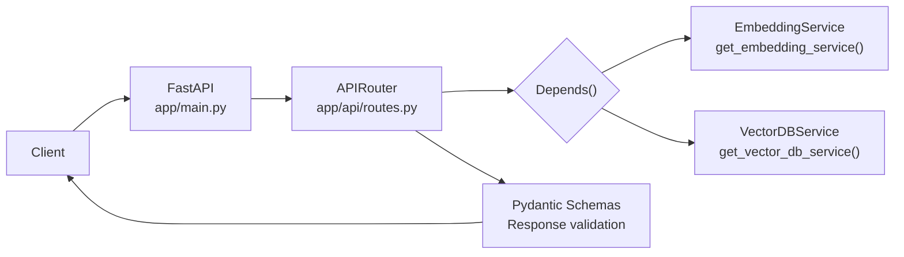
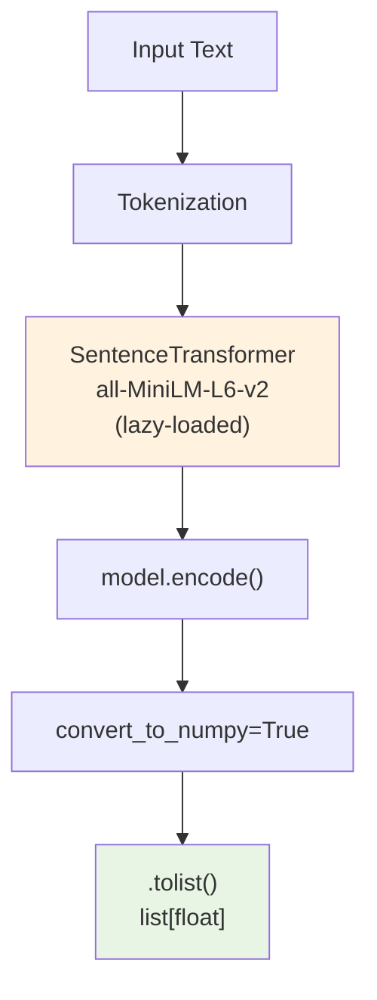
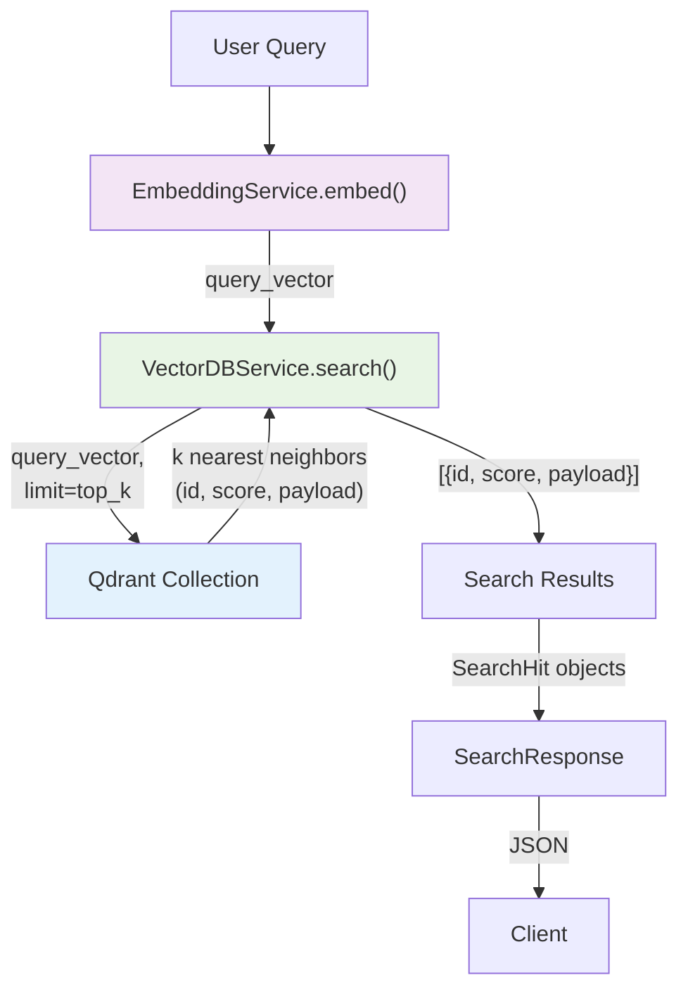

# Project Architecture

This document provides a comprehensive understanding of the existing **Vector DB POC** application — its components, data flows, and how everything connects.

---

## 1. Project Overview

### What problem does this POC solve?

Modern AI applications — particularly those using large language models (LLMs) — need to find relevant information by **meaning**, not just by keyword. Traditional keyword search (BM25) misses synonyms and semantic relationships. This POC demonstrates how to build a **semantic search** system using:

- **Vector embeddings** to convert text into mathematical representations
- **A vector database** (Qdrant) to store and search those vectors efficiently

### Main purpose

The project is a **learning resource** for understanding:

1. How text is converted into dense vector embeddings
2. How vectors are stored and indexed in a vector database
3. How semantic (meaning-based) search works end-to-end
4. How to build a Dockerized, production-style API with FastAPI

### Concepts demonstrated

- **Embedding generation** — using `sentence-transformers` to produce 384-dimensional vectors
- **Vector storage** — storing vectors with metadata (payload) in Qdrant
- **Semantic search** — finding similar documents by cosine similarity
- **Batch processing** — inserting multiple documents in one call
- **Dockerized deployment** — API, Qdrant, and MkDocs as separate services

### What happens when the application starts

1. FastAPI application initializes (`app/main.py`)
2. The API router is registered at prefix `/api/v1` (`app/api/routes.py`)
3. No services are instantiated at startup — they are lazily initialized as singletons on first request
4. The `SentenceTransformer` model is lazy-loaded on the first `/embed` or `/health` call
5. The Qdrant client is created on the first request that needs vector DB access

### Components running

| Component | Container | Port | Description |
|-----------|-----------|------|-------------|
| FastAPI API | `vector-db-api` | 8000 | The web application |
| Qdrant | `vector-db-qdrant` | 6333/6334 | Vector database |
| MkDocs (docs) | `vector-db-docs` | 8001 | Documentation site |

### External services required

- **Qdrant** — vector database (runs in Docker via `docker-compose`)
- **HuggingFace Hub** — first-time model download for `all-MiniLM-L6-v2` (cached locally after first download)

---

## 2. Project Structure

```
vector-db-poc/
├── app/                          # Application source code
│   ├── __init__.py
│   ├── main.py                   # FastAPI application factory
│   ├── config.py                 # Pydantic Settings (env-based configuration)
│   ├── api/
│   │   ├── __init__.py
│   │   └── routes.py             # API endpoints (router, service singletons)
│   ├── models/
│   │   ├── __init__.py
│   │   └── schemas.py            # Pydantic request/response models
│   └── services/
│       ├── __init__.py
│       ├── embedding.py          # SentenceTransformer wrapper (embedding generation)
│       └── vector_db.py          # Qdrant client wrapper (vector storage & search)
├── tests/                        # Test suite
│   ├── __init__.py
│   └── test_routes.py            # API integration tests
├── docs/                         # MkDocs documentation
│   ├── index.md
│   ├── api.md
│   ├── concepts.md
│   ├── development.md
│   └── vector-databases.md
├── Dockerfile                    # Production API image (Poetry + CPU torch)
├── Dockerfile.docs               # MkDocs documentation image
├── docker-compose.yml            # Multi-service orchestration
├── pyproject.toml                # Poetry project config + dependencies
├── poetry.lock                   # Locked dependency versions
├── mkdocs.yml                    # MkDocs Material theme config
├── pytest.ini                    # Pytest configuration
├── qdrant.yaml                   # Qdrant server configuration
├── .env.example                  # Example environment variables
├── .gitignore
├── .dockerignore
└── README.md
```

### File-by-file responsibilities

#### `app/main.py`
The FastAPI application entry point. Creates the `FastAPI` instance, includes the API router at prefix `/api/v1`, and defines a simple `GET /` health endpoint.

#### `app/config.py`
Uses `pydantic-settings` to load configuration from environment variables (with `.env` fallback). Defines a `Settings` class with:
- `qdrant_host` / `qdrant_port` — Qdrant connection
- `collection_name` — the Qdrant collection name (default: `"demo"`)
- `embedding_model` — the HuggingFace model name (default: `sentence-transformers/all-MiniLM-L6-v2`)
- `embedding_dim` — expected vector dimension (default: 384)

A module-level `settings` singleton is created at import time.

#### `app/api/routes.py`
Defines the `APIRouter` with 6 endpoints:

| HTTP Method | Path | Function | Description |
|-------------|------|----------|-------------|
| GET | `/health` | `health()` | Returns service status and embedding model name |
| POST | `/embed` | `embed()` | Generates embeddings for a text string |
| POST | `/documents/` | `add_document()` | Adds a single document (text + metadata) |
| POST | `/documents/batch/` | `add_documents()` | Adds multiple documents in one call |
| POST | `/search` | `search()` | Semantic search by meaning |
| DELETE | `/documents/{doc_id}` | `delete_document()` | Deletes a document by ID |

Uses a **singleton pattern** for service instances (`_embedding_service` and `_vdb_service` module-level variables) with FastAPI's `Depends()` for dependency injection. Services are lazily initialized on first access.

#### `app/services/embedding.py`
The `EmbeddingService` class wraps `sentence_transformers.SentenceTransformer`:

- `load()` — Lazy-loads the model on first call
- `embed(text)` — Generates a single embedding (returns `list[float]`)
- `embed_batch(texts)` — Generates embeddings for multiple texts
- `dimension` (property) — Returns the model's embedding dimension

#### `app/services/vector_db.py`
The `VectorDBService` class wraps `qdrant_client.QdrantClient`:

- `create_collection()` — Creates a Qdrant collection with COSINE distance and 384-dim vectors if it doesn't exist
- `upsert(points)` — Inserts points (UUID-mapped IDs, vectors, payload) — returns count
- `search(vector, top_k)` — Performs k-NN search with payload — returns list of `{id, score, payload}`
- `delete(ids)` — Deletes points by ID

Uses `uuid.uuid5(NAMESPACE_DNS, point_id)` to **deterministically** convert string document IDs to UUIDs. This ensures the same string always maps to the same UUID, enabling lookups and deletes.

#### `app/models/schemas.py`
Pydantic models for the API:

- `DocumentCreate` — `id: str`, `text: str`, `metadata: dict`
- `DocumentResponse` — `id`, `text`, `optional score`, `metadata`, `vector`
- `EmbeddingResponse` — `vector: list[float]`, `dimension: int`
- `SearchHit` — `id`, `text`, `score`, `metadata`
- `SearchResponse` — `query: str`, `hits: list[SearchHit]`
- `HealthResponse` — `status: str`, `qdrant: str`, `embedding_model: str`

#### `tests/test_routes.py`
Three tests using `httpx.AsyncClient` with the FastAPI app:
- `test_health` — verifies `/api/v1/health` returns 200 with `status == "ok"`
- `test_embed` — verifies `/api/v1/embed` returns a vector with correct dimension
- `test_root` — verifies `GET /` returns the message

#### `Dockerfile`
Python 3.11-slim based image that:
1. Installs build-essential and Poetry
2. Installs CPU-only PyTorch (avoids multi-GB CUDA wheels)
3. Uses `poetry install --only=main` to install runtime dependencies
4. Runs `uvicorn app.main:app` on port 8000

#### `Dockerfile.docs`
Python 3.11-slim based image that:
1. Installs Poetry
2. Uses `poetry install --only=docs` to install MkDocs and plugins
3. Serves documentation with `mkdocs serve` on port 8000

#### `docker-compose.yml`
Three services:
- **api** — FastAPI app (builds from `Dockerfile`, port 8000, connects to Qdrant)
- **qdrant** — Qdrant vector DB (port 6333/6334, persistent volume)
- **docs** — MkDocs documentation (builds from `Dockerfile.docs`, port 8001, live-reload volumes)

#### `qdrant.yaml`
Qdrant server config: warning-level logging, 256MB max request, telemetry disabled, no clustering, disk-based persistence.

#### `mkdocs.yml`
Material theme with dark/light mode toggle. Plugins: search + mkdocstrings (Python handler with source code display). Extensions: admonition, codehilite, TOC, attr_list, md_in_html.

---

## 3. Application Architecture

### High-level architecture

```mermaid
flowchart TD
    subgraph Client["Client"]
        C[cURL / HTTP Client]
    end

    subgraph Docker["Docker Compose"]
        subgraph API["FastAPI App (Container)"]
            Main[app/main.py<br/>FastAPI Factory]
            Routes[app/api/routes.py<br/>APIRouter]
            Schemas[app/models/schemas.py<br/>Pydantic Models]
            EmbSvc[app/services/embedding.py<br/>EmbeddingService]
            VDBSvc[app/services/vector_db.py<br/>VectorDBService]
            Config[app/config.py<br/>Settings]
        end

        subgraph Qdrant["Qdrant (Container)"]
            QDB[(Qdrant Vector DB<br/>Collection: demo)]
        end

        subgraph Docs["MkDocs (Container)"]
            MKdocs[MkDocs Server<br/>port 8001]
        end
    end

    subgraph External["External Services"]
        HF[HuggingFace Hub<br/>(model download)]
    end

    C -->|HTTP Request| Main
    Main --> Routes
    Routes --> Schemas
    Routes --> EmbSvc
    Routes --> VDBSvc
    Routes -->|Depends()| Config

    EmbSvc -->|Downloads on first use| HF
    VDBSvc -->|gRPC/HTTP| QDB
    QDB <-->|search results| VDBSvc

    MKdocs -->|serves| DocsContent[docs/*.md]
```

### Request flow



### Document ingestion flow

```mermaid
flowchart TD
    Client["Client<br/>POST /documents/"]
    API["API Router<br/>add_document()"]
    EmbSvc["EmbeddingService<br/>embed()"]
    VDBSvc["VectorDBService<br/>upsert()"]
    Qdrant["Qdrant Collection"]

    Client -->|DocumentCreate JSON| API
    API -->|doc.text| EmbSvc
    EmbSvc -->|vector: list[float]| API
    API -->|id, vector, payload| VDBSvc
    VDBSvc -->|PointStruct<br/>UUID5(id), vector, payload| Qdrant
    VDBSvc -->|inserted count| API
    API -->|DocumentResponse| Client

    style API fill:#e1f5fe
    style EmbSvc fill:#f3e5f5
    style VDBSvc fill:#e8f5e5
```

### Embedding generation flow



### Vector search flow



---

## 4. End-to-End Data Flow

### Feature: Health Check (`GET /api/v1/health`)

```mermaid
sequenceDiagram
    participant C as Client
    participant F as FastAPI
    participant R as Router (routes.py)
    participant E as EmbeddingService
    participant H as HuggingFace Hub
    participant Q as Qdrant

    C->>F: GET /api/v1/health
    F->>R: health()
    R->>E: get_embedding_service()
    E-->>R: singleton instance
    R->>E: emb.dimension
    Note over E: Lazy-loads model on first call
    E->>H: Download all-MiniLM-L6-v2 (~90MB)
    H-->>E: Model weights
    E-->>R: 384
    R->>Q: get_collections() probe
    Note over R,Q: Verifies database connectivity
    Q-->>R: {"collections": [...]}
    R-->>C: 200 HealthResponse{
        status: "ok",
        qdrant: "connected",
        embedding_model: "...",
        embedding_dim: 384
    }

    Note over C,Q: First call: lazy load + probe<br/>Subsequent: cached singletons
```

**Key code:**
```python
# app/api/routes.py:40-48
@router.get("/health", response_model=HealthResponse)
def health(emb: EmbeddingService = Depends(get_embedding_service)):
    try:
        dim = emb.dimension
    except Exception:
        dim = 0
    try:
        vdb = get_vector_db_service()
        vdb.client.get_collections()
        qdrant_status = "connected"
    except Exception:
        qdrant_status = "disconnected"
    return HealthResponse(
        status="ok", qdrant=qdrant_status,
        embedding_model=settings.embedding_model, embedding_dim=dim,
    )
```

**Improvement:** The `HealthResponse` now reports the **actual** Qdrant connectivity status (via `get_collections()` probe) instead of hardcoding `"connected"`.

### Feature: Embed Text (`POST /api/v1/embed`)

```mermaid
sequenceDiagram
    participant C as Client
    participant F as FastAPI
    participant R as Router (routes.py)
    participant E as EmbeddingService
    participant M as SentenceTransformer

    C->>F: POST /api/v1/embed {"text":"hello world"}
    F->>R: embed(request: EmbeddingRequest)
    Note over F: Body parsed via Pydantic model
    R->>E: get_embedding_service()
    E-->>R: singleton instance
    R->>E: emb.embed("hello world")
    R->>E: E.emit("embed_start", n=1)
    E->>E: self.load() — model cache check
    E->>M: model.encode("hello world", convert_to_numpy=True)
    Note over M: Forward pass through 6-layer<br/>Transformer, mean pooling
    M-->>E: NumPy array [0.012, -0.045, ...]
    E->>E: .tolist() — convert to Python floats
    E->>E: E.emit("embed_done", n=1, dim=384)
    E-->>R: [0.012, -0.045, ...] (384 floats)
    R-->>C: 200 EmbeddingResponse{
        vector: [...], dimension: 384
    }

    Note over C,M: Model loaded once, reused for all requests
```

### Feature: Add Document (`POST /api/v1/documents/`)

```
Client (DocumentCreate: id, text, metadata)
  → FastAPI
    → Router (app/api/routes.py:61, add_document())
      → Depends(get_embedding_service) → emb
      → Depends(get_vector_db_service) → vdb
      → vdb.create_collection() — creates Qdrant collection if not exists
      → emb.embed(doc.text) — generates 384-dim vector
      → payload = {"text": doc.text, "doc_id": doc.id, **metadata}
      → vdb.upsert([{id, vector, payload}])
        → to_uuid(doc.id) — deterministic UUID5 from string ID
        → QdrantClient.upsert() — stores PointStruct
      → returns DocumentResponse
  ← DocumentResponse(id, text, metadata, score=None, vector=None)
```

**Key code:**
```python
# app/api/routes.py:68-69
payload = {"text": doc.text, "doc_id": doc.id, **(doc.metadata or {})}
vdb.upsert([{"id": doc.id, "vector": vector, "payload": payload}])
```

### Feature: Batch Add Documents (`POST /api/v1/documents/batch/`)

Same as single add, but:
- Accepts `list[DocumentCreate]`
- Embeds all texts in one call: `emb.embed_batch(texts)`
- Upserts all points in one Qdrant call
- Returns `{"inserted": count, "ids": [...]}`

### Feature: Search (`POST /api/v1/search`)

```
Client (query=, top_k=5)
  → FastAPI
    → Router (app/api/routes.py:107, search())
      → Depends(get_embedding_service) → emb
      → Depends(get_vector_db_service) → vdb
      → if not vdb.client.collection_exists("demo"): raise 404
      → emb.embed(query) — generates query vector
      → vdb.search(query_vector, top_k=5)
        → QdrantClient.search() with cosine similarity
        → returns [{id, score, payload}]
      → maps results to SearchHit objects
        → id from payload["doc_id"] or hit id
        → text from payload["text"]
        → score rounded to 4 decimals
        → metadata excluding "text" and "doc_id"
  ← SearchResponse(query, hits=[SearchHit, ...])
```

### Feature: Delete Document (`DELETE /api/v1/documents/{doc_id}`)

```
Client (doc_id)
  → FastAPI
    → Router (app/api/routes.py:132, delete_document())
      → Depends(get_vector_db_service) → vdb
      → vdb.delete(ids=[doc_id])
        → to_uuid(doc_id) — same UUID5 mapping as upsert
        → QdrantClient.delete() with PointIdsList
  ← 204 No Content
```

---

## 5. Dependency Analysis

### Runtime dependencies

| Dependency | Version | Why it exists | Used in | Necessary? |
|-----------|---------|---------------|---------|-----------|
| `fastapi` | 0.115.6 | Web framework for building APIs | `app/main.py`, `app/api/routes.py` | Yes |
| `uvicorn` | 0.32.0 (with `[standard]`) | ASGI server to run the FastAPI app | Dockerfile CMD | Yes |
| `pydantic` | 2.10.4 | Data validation and settings (pulled by FastAPI) | `app/models/schemas.py` | Yes (transitive) |
| `pydantic-settings` | 2.6.1 | Settings management via env vars | `app/config.py` | Yes |
| `qdrant-client` | 1.12.1 | Qdrant vector database client | `app/services/vector_db.py`, `app/api/routes.py` | Yes |
| `sentence-transformers` | 3.3.1 | Pre-trained embedding models | `app/services/embedding.py` | Yes |
| `python-dotenv` | 1.0.0 | Load `.env` files | `app/config.py` (via pydantic-settings) | Partially (pydantic-settings can do this) |

### Development dependencies

| Dependency | Version | Why it exists | Used in |
|-----------|---------|---------------|---------|
| `pytest` | 8.3.4 | Test framework | `tests/test_routes.py` |
| `pytest-asyncio` | 0.24.0 | Async test support | `tests/test_routes.py` |
| `httpx` | 0.27.2 | HTTP client for async test client | `tests/test_routes.py` |

### Documentation dependencies

| Dependency | Version | Why it exists | Used in |
|-----------|---------|---------------|---------|
| `mkdocs` | 1.6.0 | Static site generator | `mkdocs.yml` |
| `mkdocs-material` | 9.5.0 | Material theme | `mkdocs.yml` |
| `mkdocstrings[python]` | 0.26.0 | API docs from source | `mkdocs.yml` |

### Build dependencies

| Dependency | Version | Why it exists | Used in |
|-----------|---------|---------------|---------|
| `torch` | 2.5.1 (CPU) | Required by sentence-transformers at runtime | Dockerfile |
| `poetry-core` | (in build-system) | Poetry build backend | `pyproject.toml` |

### Analysis notes

- **`python-dotenv`**: Used transitively through `pydantic-settings`, which reads `.env` files. Could potentially be removed since `pydantic-settings` handles `.env` loading natively, but it's listed as an explicit dependency for compatibility.
- **All other dependencies** are directly necessary — no unused or redundant dependencies were found.
- **Torch**: Installed separately in the Dockerfile from the CPU-only index URL to avoid pulling multi-GB CUDA wheels. This is a build-time concern only.
