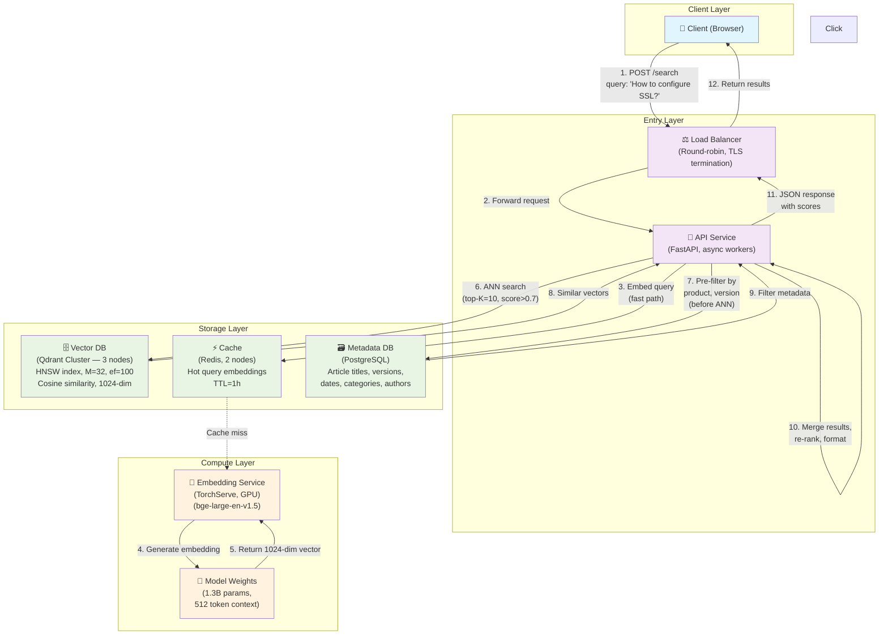

# Interview Scenarios

Realistic system design interview scenarios with full solutions.

---

## Scenario 1: Semantic Search for Technical Documents

> **Problem**: Design a semantic search system for millions of technical documentation articles.

### 1. Requirements

| Category | Requirement |
|----------|-------------|
| Functional | Search by natural language query, return relevant articles |
| Scale | 5M documents, 100–500 QPS |
| Latency | < 50ms for 95th percentile |
| Accuracy | > 85% relevant results (recall@5) |
| Filtering | By product, version, category, publish date |
| Freshness | New articles indexed within 1 hour |

### 2. High-level architecture



### 3. Components

| Component | Technology | Purpose |
|-----------|-----------|---------|
| **API Service** | FastAPI | Request handling, orchestration |
| **Embedding Service** | TorchServe | Generate query embeddings |
| **Vector DB** | Qdrant cluster (3 nodes) | ANN search over 5M vectors |
| **Metadata DB** | PostgreSQL | Article metadata, filtering |
| **Cache** | Redis | Hot query embeddings, search results |
| **Message Queue** | Kafka/RabbitMQ | Async document ingestion pipeline |

### 4. Document ingestion flow

```
New article
  ↓
Parse → Extract text
  ↓
Chunk (256 tokens, 20% overlap)
  ↓
Embed each chunk → 384-dim vector
  ↓
Store in Qdrant: {id, vector, payload={text, article_id, chunk_idx, product, version, date}}
  ↓
Store metadata in PostgreSQL
```

### 5. Search flow

```
Query: "How to configure SSL certificates?"
  ↓
[Optional: expand query — "SSL", "TLS", "HTTPS certificates"]
  ↓
Embed query → 384-dim vector
  ↓
Build filter: product IN ("nginx", "apache"), version > "2.0"
  ↓
Qdrant search: ANN on vector + metadata filter
  ↓
Top-K results (chunks)
  ↓
Group by article_id, deduplicate
  ↓
Return articles with relevance scores
```

### 6. Indexing strategy

- **Vector index**: HNSW (HNSWLib or Qdrant native)
  - `M=32` (higher recall)
  - `efConstruction=200` (better index quality)
  - `ef=100` at query time (high recall, ~95%)

- **Metadata index**: PostgreSQL indexes on `product`, `version`, `date`, `category`
  - Used for pre-filtering to reduce search space

- **Hybrid**: Pre-filter by metadata first, then ANN search within filtered subset

### 7. Scaling strategy

| Component | Scaling approach |
|-----------|-----------------|
| **API Service** | Horizontal pod autoscaling (Kubernetes) |
| **Embedding Service** | GPU instances, batch processing |
| **Vector DB** | 3-node Qdrant cluster with sharding (2 shards) |
| **Cache** | Redis cluster for hot embeddings |
| **Ingestion** | Kafka for async processing |

### 8. Chunking strategy

- **Size**: 256 tokens (fits within model context)
- **Overlap**: 50 tokens (20%)
- **Method**: Recursive (split by section headings, then paragraphs, then sentences)
- **Metadata**: Each chunk gets `chunk_idx`, `char_start`, `char_end` for reconstruction

### 9. Trade-offs

| Decision | Pro | Con |
|----------|-----|-----|
| HNSW M=32 | High recall | More memory |
| Pre-filtering | Fast search | May miss some relevant results |
| Chunking 256 tokens | Good context | More vectors to store |
| Separate metadata DB | Rich filtering | Query complexity |
| Query embedding cache | Eliminates model latency | Cache invalidation complexity |

### 10. Monitoring

```python
# Metrics to track
metrics = {
    "query_latency_p50": 15ms,
    "query_latency_p95": 45ms,
    "recall_at_5": 0.88,
    "embedding_cache_hit_rate": 0.75,
    "qdrant_cpu_utilization": 0.65,
    "failed_queries": 0.01,  # 1% error rate
}
```

### 11. Failure scenarios

| Scenario | Mitigation |
|----------|------------|
| **Qdrant node failure** | 3-node cluster with replication; queries still serve |
| **Embedding model outage** | Fallback to keyword (BM25) search; cache recent embeddings |
| **Cache miss storm** | Gradual cache warming, circuit breaker pattern |
| **Ingestion backlog** | Scale Kafka consumers, alert on queue depth |

---

## Scenario 2: RAG System for Company Documentation

> **Problem**: Design a RAG application that answers questions using company documentation.

### Pipeline overview

```
┌─────────────────────────────────────────────────────────┐
│                    DOCUMENTS                            │
│  ┌─────────────────────────────────────────────────┐   │
│  │ PDF, Wiki, Confluence, Notion docs...           │   │
│  └─────────────────────────────────────────────────┘   │
│                          ↓                             │
│                  [Ingestion Pipeline]                  │
│                          ↓                             │
│                ┌──────────────────────┐                │
│                │ Chunking             │                │
│                │ 256 tokens, 20% overlap│               │
│                └──────────┬───────────┘                │
│                           ↓                            │
│                ┌──────────────────────┐                │
│                │ Embedding          │                │
│                │ bge-large-en (1024d)│                │
│                └──────────┬───────────┘                │
│                           ↓                            │
│                ┌──────────────────────┐                │
│                │ Vector Database      │                │
│                │ (Qdrant or Pinecone) │               │
│                └──────────────────────┘                │
└─────────────────────────────────────────────────────────┘
                              ↓
┌─────────────────────────────────────────────────────────┐
│                    QUERY TIME                           │
│  ┌─────────────────────────────────────────────────┐   │
│  │ User: "How do I reset my SSO password?"         │   │
│  └─────────────────────────────────────────────────┘   │
│                          ↓                             │
│                  [Query Embedding]                    │
│                          ↓                             │
│              Vector Search (top-K=5)                   │
│                          ↓                             │
│                ┌──────────────────────┐                │
│                │ Context: 5 chunks    │                │
│                │ (~1,280 tokens)       │                │
│                └──────────┬───────────┘                │
│                           ↓                            │
│                ┌──────────────────────┐                │
│                │ LLM (GPT-4o)         │                │
│                │ Prompt: query + context│              │
│                └──────────┬───────────┘                │
│                           ↓                            │
│                ┌──────────────────────┐                │
│                │ Answer                │                │
│                └──────────────────────┘                │
└─────────────────────────────────────────────────────────┘
```

### Key decisions and analysis

#### 1. Chunking strategy

| Parameter | Choice | Reason |
|-----------|--------|--------|
| Chunk size | 256 tokens (~1,000 chars) | Fits well within LLM context |
| Overlap | 50 tokens (20%) | Reduces boundary information loss |
| Method | Recursive (by heading/paragraph) | Preserves document structure |

**Why chunking matters for RAG:**
- LLM context windows are limited (8K–128K tokens)
- Without chunking, a 10K-token document can't fit in context
- Chunking enables retrieval of relevant sections, not entire documents
- More chunks = more retrieval options but higher storage cost

#### 2. Embedding model

- **Choice**: `bge-large-en` (1,024 dimensions)
- **Why**: Higher quality than `all-MiniLM-L6-v2` for retrieval tasks
- **Trade-off**: 2.7x larger vectors, slower search (but this POC uses MiniLM at 384 dims)

#### 3. Top-K retrieval

| K value | Context tokens | Pros | Cons |
|---------|---------------|------|------|
| K=3 | ~770 | Fast, low cost | May miss relevant context |
| K=5 | ~1,280 | Good balance | Moderate cost |
| K=10 | ~2,560 | High recall | High LLM context cost |

**Recommendation**: K=5 for this POC, with query expansion to improve coverage.

#### 4. Context window management

```
LLM context: 128,000 tokens (GPT-4o)
Reserved for prompt template: 1,000 tokens
Available for context + answer: 127,000 tokens

5 chunks × 256 tokens = 1,280 tokens (well within budget)
Room for future expansion to K=20 (~5,120 tokens)
```

#### 5. Hallucination mitigation

| Technique | How it helps |
|-----------|-------------|
| **Source citations** | LLM cites which chunk it used, enabling verification |
| **Confidence thresholding** | Only answer if top-1 similarity > 0.7; otherwise say "I don't know" |
| **Grounded prompt** | "Answer ONLY using the provided context" |
| **Reranking** | Use a cross-encoder to rank chunks before passing to LLM |

#### 6. Quality improvement techniques

| Technique | How it works |
|-----------|-------------|
| **Query expansion** | Generate 2–3 related queries, search each, deduplicate |
| **HyDE** | Hypothetical Document Embeddings — embed a generated answer, not the question |
| **Reranking** | Cross-encoder re-ranks top-K results for better relevance |
| **Metadata filtering** | Filter by source/date/product before vector search |
| **Chunk windowing** | When a chunk matches, also retrieve adjacent chunks for fuller context |

#### 7. Cost analysis

| Component | Cost (1,000 queries) |
|-----------|---------------------|
| Embedding generation (local) | $0 (one-time compute) |
| Vector search (Qdrant) | $0 (local Docker) |
| LLM calls (GPT-4o, 1.3K tokens avg) | ~$0.50 |
| **Total per 1,000 queries** | ~$0.50 |
| **Total per 1M queries** | ~$500 |

#### 8. Evaluation

| Metric | Method |
|--------|--------|
| **Faithfulness** | Does the answer follow from the retrieved context? |
| **Relevance** | Is the answer relevant to the question? |
| **Context utilization** | Did the LLM use the retrieved chunks? |
| **Hallucination rate** | How often does the LLM make up facts? |

Evaluate using:
- **Labeled test set**: Human-graded Q&A pairs
- **Synthetic queries**: Generate queries from documents
- **A/B testing**: Compare model versions with real users

---

## Scenario 3: Embedding Model Migration

> **Problem**: The application currently uses `all-MiniLM-L6-v2` (384 dims), but you need to migrate to `all-mpnet-base-v2` (768 dims).

### Why this is challenging

```
Old vectors: 384 dimensions  ≠  New vectors: 768 dimensions
→ Existing vectors become INCOMPATIBLE with the new model
→ Must re-embed all documents
→ Cannot mix old and new vectors in the same collection
```

### Migration strategies

#### Strategy 1: Big bang migration (downtime)

```
Step 1: Stop writes to the system
Step 2: Re-embed all documents with the new model (768 dims)
Step 3: Delete old collection, create new one (768 dims)
Step 4: Re-index all vectors
Step 5: Resume writes
Step 6: Switch traffic to new collection

✅ Simple to implement
❌ Downtime during migration
❌ No rollback capability
❌ All-or-nothing
```

#### Strategy 2: Dual-write with versioning (zero downtime)

```
Phase 1: Dual write
  New docs → embed with BOTH models → store in separate collections
  Collection "demo_v1" (384 dims, old model)
  Collection "demo_v2" (768 dims, new model)

Phase 2: Backfill
  Re-embed all existing docs with the new model
  Store in "demo_v2"

Phase 3: Traffic switch
  Queries → embed with new model → search "demo_v2"
  Old collection "demo_v1" kept as fallback

Phase 4: Cleanup
  After monitoring period → delete "demo_v1"
```

**Implementation:**

```python
# Versioned collection names
COLLECTION_V1 = "demo_v1"  # 384 dims (old)
COLLECTION_V2 = "demo_v2"  # 768 dims (new)

class EmbeddingService:
    def __init__(self, model_name: str):
        self.model = SentenceTransformer(model_name)
        self.model_name = model_name

    def embed(self, text: str) -> list[float]:
        return self.model.encode(text, convert_to_numpy=True).tolist()

class VectorDBService:
    def __init__(self, client, collection_name, embedding_dim, distance=None):
        self.client = client
        self.collection_name = collection_name
        self.embedding_dim = embedding_dim
        self.distance = distance or qmodels.Distance.COSINE

    def create_collection(self):
        if not self.client.collection_exists(self.collection_name):
            self.client.recreate_collection(
                collection_name=self.collection_name,
                vectors_config=qmodels.VectorParams(
                    size=self.embedding_dim,
                    distance=self.distance,
                ),
            )
```

#### Strategy 3: Namespace-based (single collection, metadata tags)

Store both old and new embeddings in the same collection, tagged with model version:

```python
# Point 1 (old model)
{
    id: uuid5("doc-1__v1"),
    vector: [384 floats],
    payload: {"doc_id": "doc-1", "model": "all-MiniLM-L6-v2", "version": 1, ...}
}

# Point 2 (new model)
{
    id: uuid5("doc-1__v2"),
    vector: [768 floats],
    payload: {"doc_id": "doc-1", "model": "all-mpnet-base-v2", "version": 2, ...}
}
```

**Problem:** Can't store vectors with different dimensions in the same Qdrant collection. This approach doesn't work with Qdrant.

### Rollback strategy

If the new model performs poorly:

```
1. Switch query embedding back to old model
2. Redirect search traffic to "demo_v1"
3. Stop writes to "demo_v2"
4. Optionally delete "demo_v2" after confirming v1 is stable

Rollback time: < 1 minute (traffic switch)
Data loss: None (both collections exist during transition)
```

### Testing the migration

Before migrating, evaluate the new model:

```python
# Evaluation script
test_queries = ["How to reset password?", "Database indexing...", ...]
test_docs = [...]

for model_name in ["all-MiniLM-L6-v2", "all-mpnet-base-v2"]:
    embedder = EmbeddingService(model_name)
    # Run search with this model
    # Measure: recall@k, MRR, latency
```

Compare metrics:
- **Recall@5**: How many relevant docs are in top-5
- **MRR**: Mean Reciprocal Rank of the first relevant result
- **Latency**: Query response time

### Versioning in configuration

```toml
# pyproject.toml — already supports model_name via Settings
[tool.poetry.dependencies]
sentence-transformers = "3.3.1"  # supports both models

# app/config.py
class Settings(BaseSettings):
    embedding_model: str = "sentence-transformers/all-MiniLM-L6-v2"
    embedding_dim: int = 384
```

Migration plan:
1. Add `EMBEDDING_MODEL_NEW` env var for testing
2. Create `EmbeddingService` factory that supports both models
3. Re-embed with new model during low-traffic window
4. Switch `settings.embedding_model` to the new model
5. Update `settings.embedding_dim` to 768

### Summary

| Strategy | Downtime | Complexity | Rollback | Best for |
|----------|----------|------------|----------|----------|
| Big bang | High | Low | Difficult | Small datasets, flexible SLA |
| Dual-write | Zero | Medium | Easy | Production systems |
| Namespace | N/A | High | Easy | Systems supporting mixed dims |

For this POC: **dual-write** with versioned collection names is recommended because it's zero-downtime and easy to roll back.