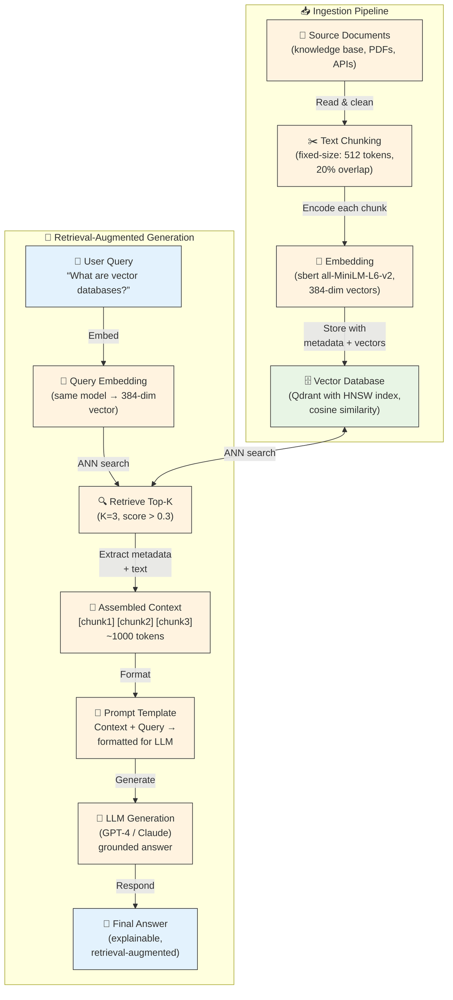

# Interview Q&A: System Design

## Semantic Search System Design

### Q1: How would you design a semantic search system?

**A:** A semantic search system finds documents by meaning, not just keywords.

#### 1. Requirements

| Requirement | Detail |
|-------------|--------|
| Functional | Search by natural language query, return relevant documents |
| Performance | < 50ms query latency |
| Scale | 1M+ documents, 100 QPS |
| Accuracy | > 90% relevant results |
| Updates | Real-time document addition |
| Filtering | Filter by metadata (source, date, category) |

#### 2. High-level architecture

```
┌─────────┐    ┌──────────────┐    ┌──────────────┐
│ Client  │───▶│ API Gateway  │───▶│ FastAPI App  │
│ (Web)   │    │ (Load Bal.)  │    │              │
└─────────┘    └──────────────┘    │  ┌─────────┐ │
                                    │  │ Embed   │ │
                                    │  │ Service │ │
                                    │  └────┬────┘ │
                                    │       │        │
                                    │  ┌────▼────┐  │
                                    │  │Vector DB│  │
                                    │  │ (Qdrant)│  │
                                    │  └─────────┘  │
                                    └──────────────┘
```

#### 3. Components

| Component | Responsibility |
|-----------|---------------|
| **API Gateway** | Load balancing, rate limiting, TLS termination |
| **FastAPI App** | Request handling, validation, orchestration |
| **Embedding Service** | Generate embeddings for queries and documents |
| **Vector DB** | Store vectors, ANN search, payload filtering |
| **Document Store** | Store original documents (metadata enrichment) |
| **Cache** | Cache frequent query results and hot embeddings |

#### 4. Data flow

1. **Ingestion**: Document → chunk → embed → store in Qdrant with payload
2. **Search**: Query → embed → ANN search → rank → format → return

#### 5. Indexing strategy

- Use HNSW index on vectors (Qdrant default)
- Index metadata fields used in filters
- Consider IVF+PQ for very large datasets

#### 6. Scaling strategy

- **Horizontal**: Shard by document ID hash; query fans out to all shards
- **Vertical**: Separate query and ingest workloads
- **Caching**: Cache embeddings for frequent queries; cache search results

#### 7. Trade-offs

| Decision | Pro | Con |
|----------|-----|-----|
| HNSW | High recall, fast | Memory overhead |
| IVF+PQ | Low memory | Lower recall |
| In-memory | Fast | Expensive |
| Disk-based | Cheaper | Slower |

---

## Scaling to Billions

### Q2: How would you search billions of embeddings efficiently?

#### Approach: Distributed sharded vector search

**Architecture:**

```
                    ┌──────────────────┐
                    │   Query Router   │
                    │                  │
                    └──────┬───┬───┬───┘
                           │   │   │
                ┌──────────┘   │   └──────────┐
                │              │              │
        ┌───────▼──────┐ ┌─────▼──────┐ ┌─────▼──────┐
        │ Shard 1      │ │ Shard 2    │ │ Shard N    │
        │ (100M vecs)  │ │ (100M vecs)│ │ (100M vecs)│
        │ HNSW index   │ │ HNSW index │ │ HNSW index │
        └──────────────┘ └────────────┘ └────────────┘
```

**Strategy:**
1. **Shard** vectors across 10+ nodes (100M vectors per shard)
2. **Parallel search** — query fires to all shards simultaneously
3. **Result merge** — collect top-k from each shard, re-rank globally
4. **Two-stage retrieval** — coarse filter first (BM25/keyword), then vector search on reduced set
5. **Quantization** — use PQ or OPQ to reduce memory footprint

**Key considerations:**
- Each shard must hold a balanced portion of vectors
- Network latency between router and shards dominates
- Result merging must handle ties and scoring across shards

### Q3: How would you handle vector database updates?

#### Batch re-indexing

```
1. New vectors → Staging area
2. Batch process: embed + index
3. Atomic swap: new index replaces old
4. Old index deleted
```

#### Incremental updates

```
1. New vector → HNSW graph insertion
2. Update affected graph nodes
3. Periodically rebuild index for optimization
```

#### Zero-downtime migration

```
Phase 1: Dual-write to old and new systems
Phase 2: Backfill new system from old
Phase 3: Read from new system (with old as fallback)
Phase 4: Stop writing to old system
Phase 5: Decommission old system
```

### Q4: How would you design a multi-tenant vector database?

#### Approaches:

1. **Shared index, filtered search** — All tenants' vectors in one collection; filter by `tenant_id` on every query
   - Pros: Resource efficiency, simpler management
   - Cons: Tenant isolation depends on correct filtering; noisy neighbors

2. **Per-tenant collections** — Each tenant has its own collection
   - Pros: Strong isolation, per-tenant tuning
   - Cons: Overhead per tenant, harder to manage at scale

3. **Namespace prefixing** — Vectors prefixed with tenant ID; query includes prefix in filter
   - Pros: Single index, logical isolation
   - Cons: Filter depends on correct implementation

---

## RAG System Design

### Q5: How would you design a RAG application?

#### Architecture



#### Key decisions

| Decision | Considerations |
|----------|----------------|
| **Chunk size** | 256–512 tokens; too small loses context, too large exceeds LLM window |
| **Chunk overlap** | 10–20% to prevent boundary information loss |
| **Top-K** | 3–10 chunks; balance relevance vs. LLM context budget |
| **Embedding model** | Match training domain; consider retrieval-specific models (e.g., `bge-rerank`) |
| **LLM context** | GPT-4o: 128K tokens; Claude: 200K; ensure chunks + query fit |

#### Improvements

- **Re-ranking**: Use a cross-encoder to re-rank retrieved chunks
- **Query expansion**: Generate multiple query variants
- **Hybrid search**: Combine keyword and vector search
- **Metadata filtering**: Filter by source/date before retrieval

---

## Production Considerations

### Q6: How would you handle embedding model changes?

**Problem:** Changing the embedding model changes vector dimensions or semantics — existing vectors become incompatible.

**Approaches:**

1. **Dual-write with versioning**:
   ```mermaid
   flowchart LR
       subgraph "Write Path"
           NewDocs["📄 New Documents\n(arriving from source)"]
           DualEmbed["🔢 Embed with BOTH\nmodels simultaneously"]
           DualStore["🗄️ Store vectors in\nboth v1 and v2\ncollections"]
       end

       subgraph "Read Path"
           Query["👤 User Query"]
           NewModel["🔢 Embed with\nNEW model (v2)"]
           NewSearch["🔍 Search only\nin v2 collection"]
           Results["📦 Results from v2\n(higher quality)"]
       end

       subgraph "Backfill"
           Backfill["🔁 Re-embed all\nold documents"]
           Switch["✅ Cut over —\ndelete v1 collection"]
       end

       NewDocs -->|"Split text"| DualEmbed
       DualEmbed -->|"v1 vector"| DualStore
       DualEmbed -->|"v2 vector"| DualStore

       Query -->|"Encode"| NewModel
       NewModel -->|"Query v2"| NewSearch
       NewSearch -->|"Results"| Results

       Backfill -->|"Batch re-embed"| Switch

       style NewDocs fill:#e3f2fd,stroke:#333
       style Query fill:#e3f2fd,stroke:#333
       style Results fill:#e8f5e5,stroke:#333
       style Switch fill:#e8f5e5,stroke:#333
style DualStore fill:#fff3e0,stroke:#333
```

2. **Namespace collections**:
   ```mermaid
   flowchart LR
       subgraph "Version 1 (Old Model)"
           V1["📚 Collection: docs_v1\n(model: sbert all-MiniLM-L6-v2,\n384-dim, cosine)"]
           V1Docs["📄 100,000 documents\n(all embedded with v1)"]
       end

       subgraph "Version 2 (New Model)"
           V2["📚 Collection: docs_v2\n(model: text-embedding-ada-002,\n1536-dim, cosine)"]
           V2Docs["📄 0 documents\n(being backfilled)"]
       end

       subgraph "Routing Layer"
           Router["🔄 API Router\nroutes query →\nappropriate collection"]
       end

       Router -->|"new queries → v2"| V2
       Router -.->|"fallback if v2 empty"| V1

       V1 --> V1Docs
       V2 --> V2Docs

       style V1 fill:#fff3e0,stroke:#333
       style V2 fill:#e8f5e5,stroke:#333
       style Router fill:#f5f5f5,stroke:#333
   ```

3. **Zero-downtime rollout**:
   - Deploy new model alongside old
   - Route new queries to new index
   - Backfill async
   - Monitor quality metrics
   - Rollback if needed

### Q7: How would you monitor a vector search system?

**Key metrics:**

| Category | Metrics |
|----------|---------|
| **Latency** | P50, P95, P99 query latency |
| **Throughput** | Queries per second, embeddings generated/sec |
| **Accuracy** | Recall@k, MRR (Mean Reciprocal Rank) |
| **Resource** | CPU, memory, disk I/O, GPU utilization |
| **Quality** | User click-through rate on search results, relevance scores |
| **Data** | Document count, vector count, collection size |

**Alerting:**
- Latency P95 > threshold
- Recall < minimum acceptable
- Memory usage > 80%
- QDR errors (failed searches)

### Q8: How would you evaluate search quality?

**Methods:**

1. **Offline evaluation**:
   - Use labeled datasets (query → relevant documents)
   - Metrics: Precision@K, Recall@K, MRR, nDCG
   - Compare embedding models, chunking strategies, metrics

2. **Online evaluation**:
   - A/B testing: compare two models with real traffic
   - Metrics: Click-through rate, time-to-answer, user satisfaction
   - Canary deployments

3. **Synthetic data**:
   - Generate queries programmatically
   - Use existing documents as both queries and targets
   - Useful for regression testing

### Q9: How would you handle duplicate documents?

**Detection:**
- Hash document text (exact duplicates)
- Embed and find near-duplicates (cosine similarity > 0.99)
- Deduplicate before indexing

**Handling:**
- Store only one copy with references to all source IDs
- Or store with a `canonical_id` field and filter duplicates at query time

### Q10: How would you reduce vector search latency?

| Technique | Impact | Complexity |
|-----------|--------|------------|
| Pre-compute and cache query embeddings | High for repeated queries | Low |
| Use larger HNSW `ef` parameter | Medium (trade recall) | Low |
| Cache search results | High for popular queries | Medium |
| Use quantization (PQ) | High (less memory bandwidth) | Medium |
| Shard across nodes | High (parallel search) | High |
| Use GPU for embedding generation | High (model inference) | High |
| Switch to faster embedding model | High (smaller model) | Low |

---

## Capacity Planning

### Q11: How much storage do vectors need?

```
1M documents × 384 dims × 4 bytes (float32) = 1.5 GB (vectors only)
Add HNSW index overhead: ~20% = ~1.8 GB
Add payload (metadata): ~3 GB
Total: ~3 GB for 1M 384-dim vectors
```

### Q12: How many queries per second can a single node handle?

| Operation | QPS (estimated) |
|-----------|-----------------|
| Embedding generation (local model) | 50–200 (CPU), 500+ (GPU) |
| Vector search (HNSW, 1M vectors, 384 dims) | 500–2,000 |
| Vector search (IVF, 100M vectors) | 1,000–5,000 |

For this POC: a single Qdrant container can handle the test workload easily. Production systems at million-scale typically use 3–10 nodes.

### Q13: What are the failure scenarios?

| Scenario | Mitigation |
|----------|------------|
| **Model download fails** | Cache model locally, fallback to older version |
| **Qdrant crashes** | Health check + automatic restart, replica nodes |
| **Embedding service OOM** | Limit concurrent requests, use smaller model |
| **Network partition** | Degrade gracefully (keyword-only search), retry with backoff |
| **Disk full** | Monitor disk usage, alert before full, archive old data |
| **Index corruption** | Regular snapshots, test restore procedures |